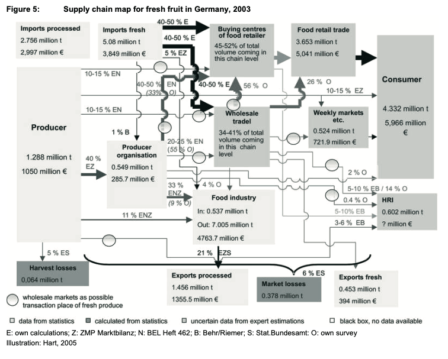

## Baumobst
- Äpfel, Birnen, Kirschen, Pflaumen, Zwetschgen, Mirabellen, Renekloden (Edel-Pflaume) (BLE, o. J.-b).

## Äpfel
- 2023/2024 war der Pro-Kopf-Verbrauch von Äpfeln in Deutschland bei 20kg und damit das meistverbrauchte Obst (ausgenommen sind Zitrusfrüchte, Schalen- und Trockenobst) (BLE, o. J.-c). Ebenso machen Äpfel rund 80% der gesamten Obsternte aus, welche 2023 bei 1,2 Millionen Tonnen lag (BLE, o. J.-a).
- Aufgrund der Popularität von Äpfeln werden diese repräsentativ für Baumobst ausgewählt und genauer im Schaubild betrachtet. 
- Es gibt tausende verschiedene Apfelsorten, mengenmäßig an Bedeutung finden in Deutschland jedoch lediglich rund 30 Sorten, vor allem Elstar. Prozentual machte Elstar 2022 rund 24% der gesamten Apfelernte aus gefolgt von Gala (9,6%), Braeburn (9,3%), Jonagold (5,8%) und Jonagored (4,2%) (Bundeszentrum für Ernährung, 2023). Die Sorten können in vier große Geschmacksrichtungen unterteilt werden: säuerlich, süß-säuerlich, süß und aromatisch (Bundesinformationszentrum Landwirtschaft, 2024a).

## Wertschöpfungskette
- Der Artikel von Hart et al. (2007, S. 9) zeigt einen ersten Überblick der Wertschöpfungskette von frischem Obst in Deutschland:

  

 

---

  

## Referenzen
- BLE. (o. J.-a). *Obstanbau: Allgemeines zum Obstanbau.* BMEL-Statistik. Abgerufen 24. Februar 2025, von <https://www.bmel-statistik.de/landwirtschaft/gartenbau/obstanbau/allgemeines-zum-obstanbau>
- BLE. (o. J.-b). *Obstanbau: Baumobst.* BMEL-Statistik. Abgerufen 24. Februar 2025, von <https://www.bmel-statistik.de/landwirtschaft/gartenbau/obstanbau/baumobst>
- BLE. (o. J.-c). *Versorgungsbilanzen: Obst, Gemüse, Zitrusfrüchte, Schalen- und Trockenobst.* BMEL-Statistik. Abgerufen 21. Februar 2025, von <https://www.bmel-statistik.de/ernaehrung/versorgungsbilanzen/obst-gemuese-zitrusfruechte-schalen-und-trockenobst>
- Bundesinformationszentrum Landwirtschaft. (2024a). *Äpfel.* Bundesanstalt für Landwirtschaft und Ernährung. <https://www.ble-medienservice.de/aepfel.html>
- Bundeszentrum für Ernährung. (2023, Januar 20). *Äpfel: Erzeugung.* <https://www.bzfe.de/lebensmittel/vom-acker-bis-zum-teller/aepfel/aepfel-erzeugung/>
- Hart, V., Kavallari, A., Schmitz, M., & Wronka, T. C. (2007). Supply Chain Analysis of Fresh Fruit and Vegetables in Germany. *Zentrum Für Internationale Entwicklungs- Und Umweltforschung Der Justus-Liebig-Universität Gießen.* <https://jlupub.ub.uni-giessen.de/server/api/core/bitstreams/99850d4f-fb74-4433-8c8f-c96976b032f3/content>

