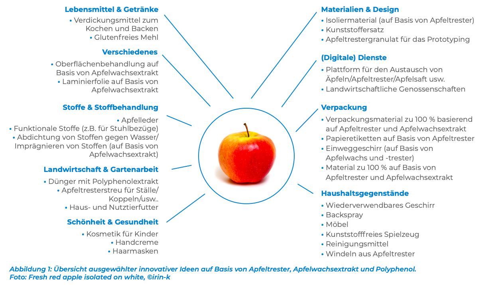

## Befruchter
Damit Apfelbäume Früchte tragen müssen die Blüten befruchtet werden. Die Bestäubung geschieht meist durch Bienen oder den Wind, jedoch können Bäume der gleichen Sorte sich nicht gegenseitig befruchten, weshalb fremde Sorten gebraucht werden und gezielt auf den Apfelplantagen positioniert werden. Dies sind meist spezielle Befruchtersorten (Bundesinformationszentrum Landwirtschaft, 2024b).

## Verwendung
Äpfel werden in Deutschland überwiegend als Tafelobst (74%) und Verwertungs- und Industrieobst (24%) verwendet. Die restlichen 2% werden nicht abgeerntet oder vermarktet (BLE, o. J.-b).

## Controlled Atmosphere
Lager mit kontrollierter Atmosphäre nutzen viel Energie, ebenso wie Importe aus Ländern wie Neuseeland und Chile (Bundeszentrum für Ernährung, 2023).

## EU-Vermarktungsnorm für Äpfel
In der EU gibt es eine gesonderte Vermarktungsnorm für Äpfel, die Angaben über die Sorte, Größe, Reife, Verpackung und Kennzeichnung von Tafeläpfeln macht. Sie betrifft nicht Industrieäpfel und Äpfel der Direktvermarktung (Peter et al., 2013; Vermarktungsnorm für Äpfel, 2011). 

## Apfeltrester Innovationen
Apfeltrester ist ein Nebenprodukt der Apfelsaftproduktion und fällt in großen Mengen an. Aufgrund der festen Konsistenz gibt es viele mögliche innovative potenzielle Nutzungsmöglichkeiten:
  - Kosmetika (Samenöl, Körpercreme),
  - Lebensmittelprodukte (Pektin (zusammen mit Wasser, Zucker und Säure ist es ein Geliermittel, Maschkowski, 2022),Nahrungsergänzungsmittel),
  - biologisch abbaubare Verpackungen und andere Waren (Apfelpapier, Geschirr, Apfelwachs).
In der folgenden Abbildung ist ein Überblick von weiteren Möglichkeiten (AlpBioEco, 2021):

  

 

---

  

## Referenzen
- AlpBioEco. (2021, März). *Factsheet Apfel-Wertschöpfungskette.* <https://www.bund-bodensee-oberschwaben.net/fileadmin/Dokumente/PDFundTexte/02_hsa-abe-fact-sheets_deutsch-bl-apple.pdf>
- BLE. (o. J.-b). *Obstanbau: Baumobst.* BMEL-Statistik. Abgerufen 24. Februar 2025, von <https://www.bmel-statistik.de/landwirtschaft/gartenbau/obstanbau/baumobst>
- Bundesinformationszentrum Landwirtschaft. (2024b, April 5). *Wozu braucht man im Apfelanbau Befruchter?* Landwirtschaft. <https://www.landwirtschaft.de/tier-und-pflanze/pflanze/obst/wozu-braucht-man-im-apfelanbau-befruchter>
- Bundeszentrum für Ernährung. (2023, Januar 20). *Äpfel: Erzeugung.* <https://www.bzfe.de/lebensmittel/vom-acker-bis-zum-teller/aepfel/aepfel-erzeugung/>
- Maschkowski, G. (2022, August 3). *Gelier- und Verdickungsmittel.* Bundeszentrum für Ernährung. <https://www.bzfe.de/lebensmittel/lebensmittelkunde/gelier-und-verdickungsmittel/>
- Peter, G., Kuhnert, H., Haß, M., Banse, M., Roser, S., Trierweiler, B., & Adler, C. (2013). *Einschätzung der pflanzlichen Lebensmittelverluste im Bereich der landwirtschaftlichen Urproduktion* (Bericht im Auftrag des Bundesministeriums für Ernährung, Landwirtschaft und Verbraucherschutz (BMELV)). Johann Heinrich von Thünen-Institut, Max Rubner-Institut, Julius Kühn-Institut. <https://literatur.thuenen.de/digbib_extern/dn052055.pdf>
- Vermarktungsnorm für Äpfel, 543/2011 (2011). <https://www.ble.de/SharedDocs/Downloads/DE/Ernaehrung-Lebensmittel/Vermarktungsnormen/VermarktungsnormenObstGemuese/EG_Vermarktungsnormen/Aepfel.pdf?__blob=publicationFile&v=1>

