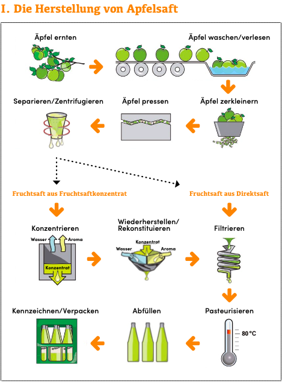

- Äpfel werden zu Apfelsaft, Apfelnektar, Apfelsaftgetränken, Apfelwein und Cider verarbeitet (Felgentreff & Müller, 2023).

## Apfelsaft
- Äpfel werden zu Apfelsaft verarbeitet, welcher in vielen verschiedenen Varianten erhältlich ist: pur, verdünnt, naturtrüb, klar (Felgentreff & Müller, 2023).

# Apfelsaftherstellung
Mostereien verarbeiten Äpfel zu Direktsaft, welcher die Grundlage für alle weiteren Säfte ist. Aus 1,5kg Äpfeln, circa 7 Stück werden rund 1 Liter Direktsaft. 
Prozess der Apfelsaftherstellung (Felgentreff & Müller, 2023):
  1. Reife Früchte waschen und verlesen
  2. Früchte in Mühle zu Maische vermahlen, Zugabe von Enzymen, um Pektine und Stärke abzubauen, sodass der Saftaustritt aus den Zellwänden erleichtert wird.
  3. Maische pressen und man erhält naturtrüben Apfelsaft mit Fruchtfleisch
  4. Saft zentrifugieren (entfernt Fruchtfleisch und Trübstoffe)
  5. Naturtrüben Apfelsaft abfüllen.
  6. Saft pasteurisieren für eine längere Haltbarkeit (wenige Sekunden auf 85°C, da der Saft sonst gärt).

  

(Wissen ist Saft, 2021, S. 41)

Apfelsaftkonzentrat ist ebenfalls ein wichtiges Produkt. Es besteht aus Direktsaft, welchem die Flüssigkeit entzogen wurde. Dieses Konzentrat kann mit gefiltertem Trinkwasser wieder zu "Apfelsaft" verwandelt werden (Felgentreff & Müller, 2023).

## Apfeltrester
- Apfeltrester ist ein Nebenprodukt der Apfelsaftproduktion. Es ist ein fester Rückstand, welcher nach der Pressung in großen Mengen übrigbleibt, und ein Abfallprodukt ist (AlpBioEco, 2021).
- Innovative Nutzungsansätze von Apfeltrester werden auf der Seite "Weitere Wichtige Informationen" erläutert.

 

---

  

## Referenzen
- AlpBioEco. (2021, März). *Factsheet Apfel-Wertschöpfungskette.* <https://www.bund-bodensee-oberschwaben.net/fileadmin/Dokumente/PDFundTexte/02_hsa-abe-fact-sheets_deutsch-bl-apple.pdf>
- Felgentreff, U., & Müller, C. (2023, Juli 19). *Äpfel: Verarbeitung.* Bundeszentrum für Ernährung. <https://www.bzfe.de/lebensmittel/vom-acker-bis-zum-teller/aepfel/aepfel-verarbeitung/>
- *Wissen ist Saft.* (2021). Verband der deutschen Fruchtsaft-Industrie e. V. <https://www.fruchtsaft.de/ueber-uns/informationen>

