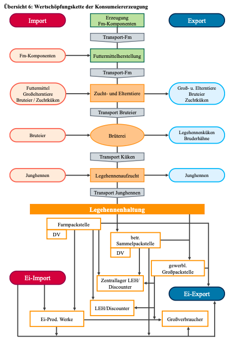
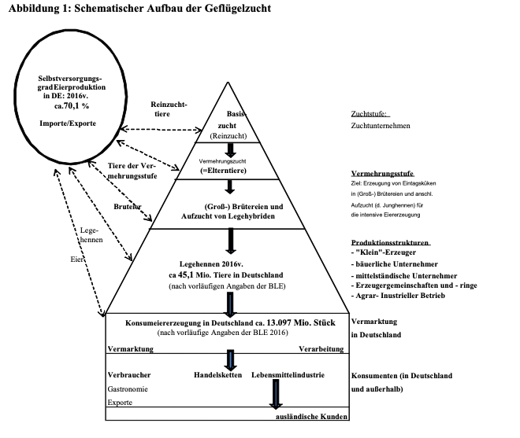

Die folgenden zwei Abbildungen geben einen ersten Überblick über die Wertschöpfungskette von Konsumeiern:

  

(BLE, 2024b)

  

(BLE, 2017, S. 7)

 

---

  

## Referenzen
- BLE. (2017). *Bericht zur Markt- und Versorgungslage Eier.* <https://www.bmel-statistik.de/fileadmin/daten/0611080-2017.pdf>
- BLE. (2024b). *Bericht zur Markt- und Versorgungslage mit Eiern 2024.* <https://www.bmel-statistik.de/fileadmin/daten/0611080-2024.pdf>
