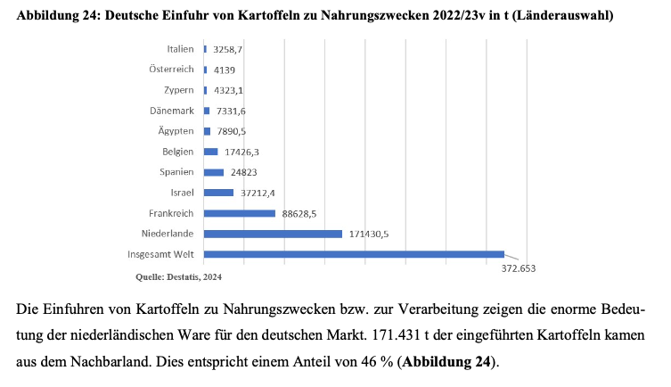

- 2023/2024 wurden nur etwa 2.5 Millionen Tonnen Kartoffeln (frisch oder verarbeitet) importiert (BLE, o. J.-c). Dies ist substanziell weniger als das Exportvolumen.
- Importe kommen aus Ägypten (besonders kleine und junge Kartoffeln am Anfang des Jahres), Spanien und Israel (BLE, 2024).
- Folgende Abbildung zeigt einen Überblick der Einfuhrländer von Kartoffeln in 2022/2023 (BLE, 2024):

  

 

---

  

## Referenzen
- BLE. (o. J.-c). *Versorgungsbilanzen: Kartoffeln.* BMEL-Statistik. Abgerufen 25. Februar 2025, von <https://www.bmel-statistik.de/ernaehrung/versorgungsbilanzen/kartoffeln>
- BLE. (2024). *Bericht zur Markt- und Versorgungslage Kartoffeln.* <https://www.bmel-statistik.de/fileadmin/daten/0611010-2024.pdf>
