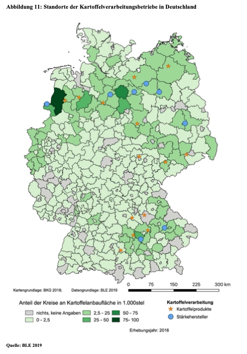

- Es gibt **Speisekartoffeln** und **Wirtschaftskartoffeln** (Industriekartoffeln), wobei Speisekartoffeln überwiegend angebaut werden (Bundesinformationszentrum Landwirtschaft, 2024c). Speisekartoffeln werden zum Teil als Kartoffelerzeugnisse weiterverarbeitet werden. Dies sind zum Beispiel Pommes Frites, Kartoffelsalat, und Chips (BLE, o. J.-c; Peter et al., 2013). Neben diesen beiden Kartoffelarten gibt es auch **Pflanzkartoffeln**, welche das Saatgut für die nächste Saison sind (Bundesamt für Verbraucherschutz und Lebensmittelsicherheit, o. J.).
- Kartoffeln, die für die Verarbeitung bestimmt sind, werden meist im Vertragsanbau angebaut (Peter et al., 2013).
- Bei den Kartoffeln überwiegt der konventionelle Anbau, lediglich 4% werden ökologisch angebaut (Bundesinformationszentrum Landwirtschaft, 2024c).
- Kartoffeln werden ebenso wie Möhren auf Erddämmen angebaut. Die Pflanzkartoffeln (Saatgut) werden mit einer Kartoffel-Legemaschine im April/Mai in den Boden gelegt. Voraussetzung ist, dass der Boden trocken genug ist und eine Bodentemperatur zwischen 8°C und 10°C hat. Die Dämme sind daher besonders vorteilhaft für die wärmeliebenden Pflanzen, da sich die Erde schneller erwärmt (Bundesinformationszentrum Landwirtschaft, 2024c). 
- Bevor die Kartoffeln angepflanzt werden können, ist die Bodenbearbeitung sehr wichtig (Bundesinformationszentrum Landwirtschaft, 2024b).
- Drei bis vier Wochen vor der Kartoffelernte wird das Kraut der Kartoffel vernichtet (konventioneller Anbau mit Herbiziden, ökologischer Anbau mechanisch abgehakt). Wenn das Kraut stehen gelassen würde, würden die Knollen zu groß werden und erst nach dem Vernichten des Krauts wird die Schale der Kartoffeln hart (Land schafft Leben, o. J.). Das Fachwort ist Sikkation.
- Geerntet werden die Kartoffeln je nach Sorte von Juni/Juli bis September/Oktober. Vor der Ernte wird die Daumenprobe durchgeführt, um zu schauen, ob die Schale fest genug ist. Dann nehmen Roder (Erntemaschinen) bis zu vier Dämme auf einmal auf und die Knollen werden herausgesiebt. Steine werden auch aussortiert. Meistens passiert dies maschinell, teilweise noch per Hand (Bundesinformationszentrum Landwirtschaft, 2024c). 
- Um Kartoffeln früher ernten zu können werden bei sehr frühen Sorten die Kartoffeln vorgekeimt. Dies beginnt bereits im Januar/Februar. Ebenso können Felder/Dämme mit einer Folie abgedeckt werden (Bundesinformationszentrum Landwirtschaft, 2024c). 

## Selbstversorgungsgrad
- Der SVG lag 2023/2024 bei 153% (BLE, o. J.-c).
- Weltweit ist Deutschland auf Platz 10 der größten Kartoffelerzeuger, China liegt auf Platz 1 (BLE, 2024).

## Verwendung
In Deutschland werden Kartoffeln überwiegend als Nahrungsmittel verwendet (Speisekartoffeln und Kartoffelerzeugnisse), sowie zur Stärke Produktion. Dies wird in folgender Grafik dargestellt:

  

(BLE, o. J.-c).

Der Gesamtverbrauch von Kartoffeln liegt bei rund 7.000 Tonnen (2023/2024) (BLE, o. J.-c).

## Kartoffelanbaufläche und -regionen

- Die **Anbaufläche** lag 2023 bei 264.700 Hektar mit einem Ertrag von 11.6 Millionen Tonnen Kartoffeln (BLE, o. J.-b, o. J.-c; Bundesinformationszentrum Landwirtschaft, 2024c). Im Vergleich dazu lag die Anbaufläche 2024 bei 282.000 Hektar mit einer Kartoffelernte von 12.7 Millionen Tonnen. 25.820 Höfe bauten Kartoffeln an (BLE, o. J.-a). 
- Niedersachsen baute 2024 die meisten Kartoffeln an, ungefähr 46% der gesamten Anbaufläche liegen hier (Bundesinformationszentrum Landwirtschaft, 2024c). Die Ernte entsprach fast die Hälfte der Kartoffeln (6.1 Millionen Tonnen auf 133.800 Hektar) (BLE, o. J.-a). In folgender Grafik wird eine Übersicht der Kartoffelackerflächen nach Kreisen (2021) dargestellt (BLE, 2024):

  

- Niedersachsen hat zusätzlich einen hohen Anteil an beregneten Kartoffelflächen, weshalb die Ertragslage auch bei geringen Niederschlägen in Niedersachsen relativ stabil ist. Ebenso sind in den Hauptanbaugebieten, wie Niedersachsen viele Verarbeitungsindustrien angesiedelt, sodass kurze Transportwege herrschen. Dies wird in der nachfolgenden Grafik verdeutlicht (BLE, 2024).

  

- Die **Erntemengen und Hektarerträge schwanken von Jahr zu Jahr** (2024 war der Ertrag höher als 2023). Dies liegt unteranderem an der **Fruchtfolge** im Kartoffelanbau. Der durchschnittliche Hektarertrag und die Anbaufläche lag 2018-2022 bei 10.7 Millionen Hektar und 40,2 Tonnen/Hektar (Bundeszentrum für Ernährung, 2023b).
- Bayern und Nordrhein-Westfalen bauen auch viele Kartoffeln an, ihre Anteile der gesamten Anbaufläche liegen jedoch deutlich niedriger bei jeweils ungefähr 15% (Bundesinformationszentrum Landwirtschaft, 2024c).
- Kartoffeln werden wie viele andere Gemüsesorten in einer Fruchtfolge angebaut, um möglichst hohe Erträge zu erzielen (BLE, 2024).

## Kartoffelsorten

- Bei den Kartoffeln wird hauptsächlich zwischen **Speisesorten und Wirtschaftssorten** unterschieden. Industriell genutzt Kartoffeln haben meist einen höheren Stärkegehalt, sowie eventuell je nach Verarbeitung eine große Knolle und eine glatte Oberfläche. 2022 war die meistangebaute Speisesorte "Belana" mit 4,6% und die meistangebaute Wirtschaftssorte war "Fontane" mit 8,9% Marktanteil (BLE, o. J.-a).
- Eine zusätzliche Unterteilung von Kartoffelsorten erfolgt durch die **Reifezeit**: früh-, mittelfrüh-, und spätreifende Kartoffeln (BLE, o. J.-b).
- Verbraucher unterschieden Kartoffeln meist durch ihre **Kocheigenschaften**: festkochend, vorwiegend festkochend, mehligkochend. So sind festkochende Sorten besser geeignet für Kartoffelsalat und mehligkochende für Püree (Bundesinformationszentrum Landwirtschaft, 2024c). 
- Es gibt große Unterschiede bei den Koch- und Verarbeitungseigenschaften von verschiedenen Kartoffelsorten (Rösch & Icking, 2023).

## Reifezeit

Die Reifezeit von Kartoffeln variiert von 90 bis 160 Tagen (Bundesinformationszentrum Landwirtschaft, 2024c; Bundeszentrum für Ernährung, 2023b):
  - **Sehr früh**: 90-110 Tage, meist vorgekeimt (bevor die Kartoffeln ausgesäht werden), Verkauf im Juni/Juli.
  - **Früh**: 110-120 Tage, etwas festere Schale, Verkauf im Juli/August.
  - **Mittelfrüh**: 120-140 Tage, Verkauf Ende August, größte Sortengruppe, Lagerfähigkeit gut.
  - **Mittelspät bis spät**: 140-160 Tage, "Einkellerungskartoffel", Verkauf im September/Oktober.

  

(BLE, 2024).

 

---

  

## Referenzen
- BLE. (o. J.-a). *Bodennutzung und pflanzliche Erzeugung: Anbau von Kartoffeln und Zuckerrüben.* BMEL-Statistik. Abgerufen 25. Februar 2025, von <https://www.bmel-statistik.de/landwirtschaft/bodennutzung-und-pflanzliche-erzeugung/hackfruechte>
- BLE. (o. J.-b). *Ernte und Qualität: Kartoffelernte.* BMEL-Statistik. Abgerufen 25. Februar 2025, von <https://www.bmel-statistik.de/landwirtschaft/ernte-und-qualitaet/kartoffelernte>
- BLE. (o. J.-c). *Versorgungsbilanzen: Kartoffeln.* BMEL-Statistik. Abgerufen 25. Februar 2025, von <https://www.bmel-statistik.de/ernaehrung/versorgungsbilanzen/kartoffeln>
- BLE. (2024). *Bericht zur Markt- und Versorgungslage Kartoffeln.* <https://www.bmel-statistik.de/fileadmin/daten/0611010-2024.pdf>
- Bundesamt für Verbraucherschutz und Lebensmittelsicherheit. (o. J.). *Verwendungszwecke von Kartoffeln.* Abgerufen 25. Februar 2025, von <https://www.bvl.bund.de/DE/Arbeitsbereiche/04_Pflanzenschutzmittel/03_Antragsteller/04_Zulassungsverfahren/03_Wirksamkeit_Anwendung/psm_wirksamk_verwendung_kartoffeln.html>
- Bundesinformationszentrum Landwirtschaft. (2024b, Februar 5). *Dem Ackerbauern über die Schulter geschaut.* Landwirtschaft.de. <https://www.landwirtschaft.de/tier-und-pflanze/pflanze/getreide/dem-ackerbauern-ueber-die-schulter-geschaut>
- Bundesinformationszentrum Landwirtschaft. (2024c, November 27). *Kartoffeln.* Landwirtschaft.de. <https://www.landwirtschaft.de/einkauf/lebensmittel/pflanzliche-lebensmittel/kartoffeln>
- Bundeszentrum für Ernährung. (2023b, Oktober 10). *Kartoffeln: Erzeugung.* <https://www.bzfe.de/lebensmittel/vom-acker-bis-zum-teller/kartoffeln/kartoffeln-erzeugung/>
- Land schafft Leben. (o. J.). *Kartoffel Herstellung: Schädlinge, Pflanzenschutz, Lagerung.* Abgerufen 28. Februar 2025, von <https://landschafftleben.at/>
- Peter, G., Kuhnert, H., Haß, M., Banse, M., Roser, S., Trierweiler, B., & Adler, C. (2013). *Einschätzung der pflanzlichen Lebensmittelverluste im Bereich der landwirtschaftlichen Urproduktion* (Bericht im Auftrag des Bundesministeriums für Ernährung, Landwirtschaft und Verbraucherschutz (BMELV)). Johann Heinrich von Thünen-Institut, Max Rubner-Institut, Julius Kühn-Institut. <https://literatur.thuenen.de/digbib_extern/dn052055.pdf>
- Rösch, R., & Icking, J. (2023, August 9). *Kartoffeln: Zubereitung und Lagerung.* Bundeszentrum für Ernährung. <https://www.bzfe.de/lebensmittel/vom-acker-bis-zum-teller/kartoffeln/kartoffeln-zubereitung-und-lagerung/>
