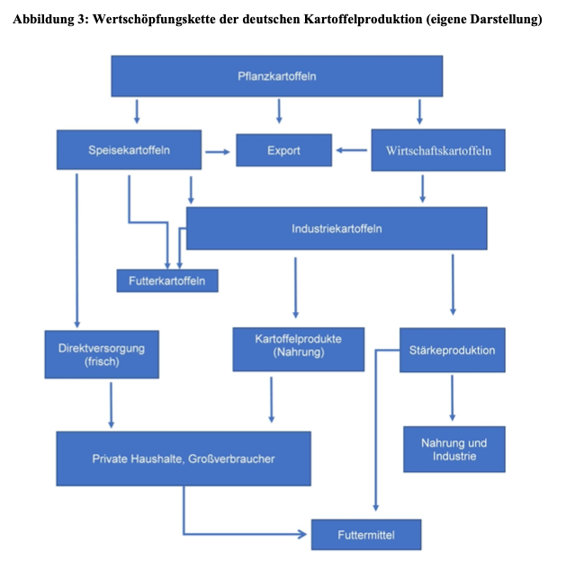

- Kartoffeln gehören zu den **Hackfrüchten**. Hackfrüchte sind Kulturpflanzen, bei deren Anbau durch wiederholtes Hacken des Bodens Beikräuter entfernt werden (so werden sie nicht überwachsen) (BLE, o. J.-a).
- Botanisch sind Kartoffeln **Nachtschattengewächse**. Ihr oberirdisches Kraut trägt weiße oder lilafarbene Blüten und die Kartoffelknollen wachsen unter der Erde. Aus einer Mutterknolle wachsen Ausläufer, die botanisch gesehen Sprossen sind. Diese schwellen an und es entstehen neue Kartoffeln. 
Als Schutz bildet die Pflanze eine Art Korkgewebe, die Schale. Aus den Augen der Knollen wachsen nach einer Ruhepause wieder Keime, die sich von der Stärke in den Knollen ernähren (Bundesinformationszentrum Landwirtschaft, 2024c). 

- Laut der Weltgesundheitsorganisation sind Kartoffeln weder Obst noch Gemüse, sondern werden zu Getreide dazugezählt (Landwirtschaft verstehen, o. J.).
- Es gibt weltweit rund 5000 Kartoffelsorten (BLE, 2024). Dabei gibt es verschiedene Schalenfarben und Fruchtfleischfarben: hellgelb, rosa, violett bis dunkelbraun/hellbeige bis blau oder zweifarbig (Landwirtschaft verstehen, o. J.).

## Wertschöpfungskette
Der Bericht über Kartoffeln 2024 vom BLE gibt einen ersten Überblick über die Wertschöpfungskette von Kartoffeln in Deutschland (BLE, 2024):

  

 

---

  

## Referenzen
- BLE. (o. J.-a). *Bodennutzung und pflanzliche Erzeugung: Anbau von Kartoffeln und Zuckerrüben.* BMEL-Statistik. Abgerufen 25. Februar 2025, von <https://www.bmel-statistik.de/landwirtschaft/bodennutzung-und-pflanzliche-erzeugung/hackfruechte>
- BLE. (2024). *Bericht zur Markt- und Versorgungslage Kartoffeln.* <https://www.bmel-statistik.de/fileadmin/daten/0611010-2024.pdf>
- Bundesinformationszentrum Landwirtschaft. (2024c, November 27). *Kartoffeln.* Landwirtschaft.de. <https://www.landwirtschaft.de/einkauf/lebensmittel/pflanzliche-lebensmittel/kartoffeln>
- Landwirtschaft verstehen. (o. J.). *Erdäpfel: Ein Gemüse, das eigentlich ein Getreide ist.* Abgerufen 28. Februar 2025, von <https://www.landwirtschaft-verstehen.at/landwirtschaft-fuer-alle/weg-der-lebensmittel/erdaepfel>

