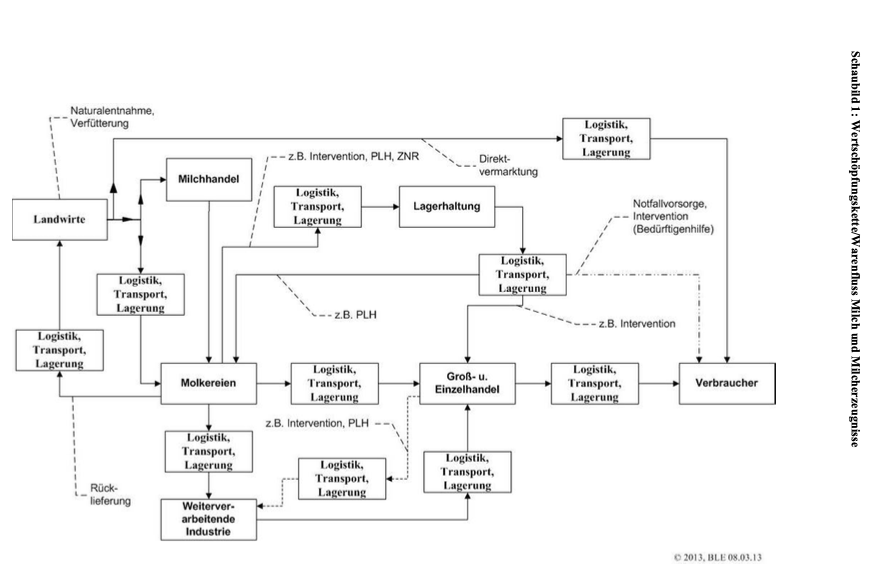
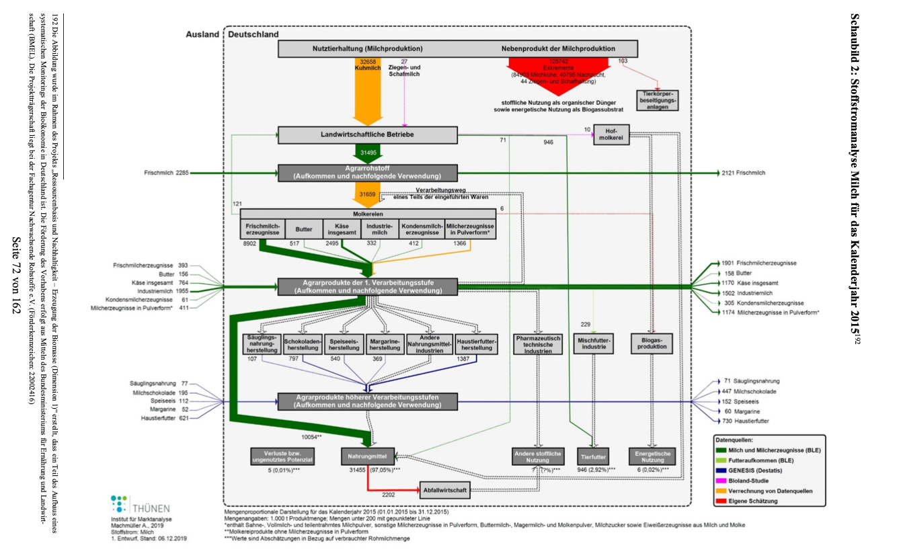

- Der Bericht zur Markt- und Versorgungslage mit Milch und Milcherzeugnissen 2024 von der BMEL liefert wichtige Informationen über die Wertschöpfungskette von Milch und Milcherzeugnissen. Insbesondere die Schaubilder 1 & 2 (S. 71 & 72) liefern wertvolle Informationen über die Produkte, welche aus Milch hergestellt werden können (BLE, 2024).
- Anders als Getreide, gibt es bei Milch & Milcherzeugnissen keine Bestände (BLE, 2024).
- Der Fokus wird auf Kuhmilch gelegt und nicht auf Ziegen- und Schafsmilch.

  

  

 

---

  

## Referenzen

- BLE. (2024). *Bericht zur Markt- und Versorgungslage mit Milch und Milcherzeugnissen.* <https://www.bmel-statistik.de/fileadmin/daten/0611100-2024.pdf>
