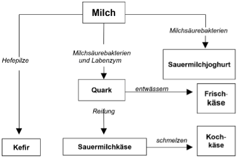

## Milchsorten nach Herstellungsverfahren

# Rohmilch
"Unter Rohmilch versteht man frische, unbehandelte Kuhmilch. Auf europäischer Ebene ist Rohmilch in der Verordnung (EG) Nr. 853/2004 geregelt und als „das unveränderte Gemelk von Nutztieren, das nicht über 40°C erhitzt und keiner Behandlung mit ähnlicher Wirkung unterzogen wurde“ definiert. Für die Verwertung von Rohmilch gelten strenge hygienische Auflagen.
In Deutschland darf Rohmilch nur unter bestimmten hygienischen Voraussetzungen und häufigen Kontrollen direkt ab Hof verkauft werden. Um die Infektionsgefahr zu minimieren, sollte Rohmilch vor dem Verzehr unbedingt abgekocht werden. Dieser Hinweis muss deutlich auf der Verpackung oder am Verkaufsort gekennzeichnet sein. Im Handel darf Rohmilch nur in Form von Vorzugsmilch verkauft werden. Diese ist wie Rohmilch unbehandelt und nur gefiltert und gekühlt. Im Unterschied zu anderen Milchsorten ist die Vorzugsmilch nicht mit einem Mindesthaltbarkeitsdatum gekennzeichnet, sondern mit einem Verbrauchsdatum. Sie sollte spätestens 4 Tage nach der Gewinnung verbraucht werden." (MIV Milchindustrie-Verband e.V., o. J.-f)

# Frischmilch
"Frischmilch ist die häufig verwendete Bezeichnung für pasteurisierte Milch, dabei gibt es heute zwei Varianten:

1. Traditionell hergestellte Frischmilch: wird kurzzeiterhitzt (15 – 30 Sek., 72 – 75 °C)
2. Länger haltbare, sogenannte ESL-Milch: wird entweder direkt/indirekt hocherhitzt (1 – 4 Sek., 85 – 127 °C) oder mikrofiltriert. Ungeöffnet hält traditionell hergestellte Frischmilch 7 – 10 Tage und ESL-Milch ca. doppelt so lange (bis zu 21 Tagen), beide müssen im Kühlschrank gelagert werden. Nach dem Öffnen sollten beide Varianten innerhalb von drei Tagen verzehrt werden." (MIV Milchindustrie-Verband e.V., o. J.-a) 

# Haltbare Milch (H-Milch)
Ultrahocherhitze Milch, welche ohne Kühlung mehrere Monate haltbar ist (AOK Gesundheitsmagazin, 2024).

# Laktosefreie Milch
Normale Milch enthält Milchzucker (Laktose). Menschen mit einer Laktoseintoleranz können diesen Milchzucker im Darm nicht abbauen, da sie einen Mangel des Enzyms Laktase haben. Milchzucker wird durch Laktase in Glukose und Galaktose gespalten, deshalb fügen Molkereien der Milch Laktase zu, sodass die laktosefreie Milch Glukose und Galaktose enthält anstatt Milchzucker (AOK Gesundheitsmagazin, 2024).

## Milchsorten nach Fettgehalt

# Vollmilch
Vollmilch hat einen Fettgehalt von mindestens 3,5%. Dieser variiert je nachdem wie viel Rahm die Molkereien der Magermilch nach der Entrahmung wieder zuführen (AOK Gesundheitsmagazin, 2024).

# Fettarme Milch
Fettarme Milch hat einen geringeren Fettanteil als Vollmilch, dieser liegt zwischen 1,5 und 1,8%. Ebenso wie bei der Vollmilch wird der Fettgehalt durch die Zugabe von Rahm zur Magermilch erreicht (AOK Gesundheitsmagazin, 2024).

# Magermilch
Magermilch ist Rohmilch, welche in den Molkereien zentrifugiert wird (Aufteilung in Rahm und Magermilch), jedoch keinen Rahm beigefügt bekommt. Magermilch hat daher einen sehr geringen Fettanteil von höchstens 0,5% (AOK Gesundheitsmagazin, 2024).

## Milcherzeugnisse

Es können viele verschiedene Produkte aus Milch hergestellt werden. Für viele Produkte sind zusätzliche Stoffe notwendig, wie z. B. Bakterien (Freies Lehrbuch Biologie: 07.01 Bakterien und Milchprodukte, 2021):

- Lab(enzym) wird aus Kälbermägen gewonnen (Wirkstoff Rennin) - weitere Infos zu Lab sind auf der Seite "Historische Schwierigkeiten" zu finden

  

  
- Kefir: Zugabe von Kefirkörnern (Körnchen aus geronnenem Eiweiß, welche einen Hefepilz enthalten). Es findet also gleichzeitig eine Milchsäuregärung und eine alkoholische Gärung statt. Kefir enthält also auch Alkohol.
- Sauermilch: Milch, der Kulturen von Milchsäurebakterien zugefügt wurden. Durch Entwässerung kann daraus Dickmilch hergestellt werden.
- Joghurt: Zu Milch wird eine Mischkultur aus Milchsäurebakterien zugefügt und dann lässt man alles bei ca. bei ca. 42°C zwei bis drei Stunden wachsen.

- Milch wird in der Molkerei in Rahm und (Mager)milch zentrifugiert (Landwirtschaft verstehen, o. J.).
- Rahm wird verwendet, um Butter herzustellen. Dabei gibt es einen Unterschied zwischen Süßrahmbutter und Sauerrahmbutter (Landwirtschaft verstehen, o. J.).
- Sauermilchprodukte sind fermentierte Produkte, welche durch Bakterien eine Säuerung durchgangen sind. Hierzu zählen folgende Produkte: Joghurt, Sauerrahm, Crème Fraîche, Kefir, und Buttermilch (Landwirtschaft verstehen, o. J.).
- Flüssige Molkeerzeugnisse: Echte Molke und Trinkmolke (Landwirtschaft verstehen, o. J.).

- **Butter**: "Butter ist eine Emulsion überwiegend nach dem Typ Wasser in Öl und hat einen Milchfettgehalt zwischen 80 % und 90 %. Butter darf die Höchstanteile von 16 % Wasser sowie 2 % fettfreier Trockenmasse aufweisen. Butter kann ein Ausgangsprodukt für die Herstellung von Milchfett- und Milchstreichfetterzeugnissen mit unterschiedlichen Fettgehältern sein." (BLE, 2024, S. 144).
- **Buttermilch**: "Buttermilch fällt bei der Butterherstellung als Kuppel-/Koppelprodukt an. Sie kann als Ausgangsprodukt für andere Nahrungsmittel und zur Verfütterung genutzt werden. Als Nahrungsmittel wird Buttermilch den Frischmilcherzeugnissen zugeordnet." (BLE, 2024, S. 144).
- **Frischmilcherzeugnisse**: "Zu Frischmilcherzeugnissen werden gezählt: Konsummilch (Vollmilch, teilentrahmte Milch, entrahmte Milch, Sonstige Konsummilch, Vorzugsmilch, direkt vermarktete Milch und Naturalentnahmen im Erzeugerhaushalt), Sahneerzeugnisse, Buttermilcherzeugnisse, Sauermilch-, Kefir-, Joghurt- und Milchmischerzeugnisse sowie Milchmischgetränke." (BLE, 2024, S. 145).
- **Käse**: "Käse sind nach Käseverordnung (KäseV) frische oder in verschiedenen Graden der Reife befindliche Erzeugnisse, die aus dickgelegter Käsereimilch hergestellt werden. Käsereimilch ist zur Herstellung von Käse bestimmte Milch, Milcherzeugnisse oder Molke. Käse und Käseerzeugnisse werden entsprechend ihrem Fettgehalt in der Trockenmasse (Fett i. Tr.) in Verkehr gebracht." (BLE, 2024, S. 145).
- **Konsummilch**: "Die folgenden Erzeugnisse werden der Konsummilch zugerechnet: Rohmilch, Vollmilch, (Fettgehalt mindestens 3,5 % Fett), Teilentrahmte Milch (mindestens 1,5 % und höchstens 1,8 % Fett), Entrahmte Milch (höchstens 0,5 % Fett) und Sonstige Konsummilch." (BLE, 2024, S. 145).
- **Milch**: "Die Milch besteht aus Wasser und Trockenmasse (Fett und fettfreie Trockenmasse). Zur fettfreien Trockenmasse gehören Eiweiße, Lactose und Asche." (BLE, 2024, S. 148).
- **Sahneerzeugnisse**: "Nach der Milcherzeugnisverordnung (MilchErzV) können Sahneerzeugnisse (Rahmerzeugnisse) durch das Trennen der Sahne von der Milch oder durch das Einstellen auf einen Fettgehalt von mindestens 10% hergestellt werden. Zu den Sahneerzeugnissen zählen Kaffeesahne, Schlagsahne sowie Sonstige Sahneerzeugnisse." (BLE, 2024, S. 149).
- **Trockenmilcherzeugnisse**: "Für die Herstellung von Trockenmilcherzeugnissen werden zumeist bereits vorkonzentrierte Erzeugnisse weiter konzentriert und getrocknet. Trockenmilcherzeugnisse sind pulverisiert und zeichnen sich durch eine lange Haltbarkeit aus." (BLE, 2024, S. 149).

## Selbstversorgungsgrad von Milch und Milcherzeugnissen

Der Selbstversorgungsgrad von Milch und Milcherzeugnissen in Deutschland wird in verschiedene Kategorien unterteilt und jährlich vom BLE veröffentlich. 
Folgende Daten sind in Prozent und für das Jahr 2023 (BLE, 2024, S. 80):
a. Frischmilcherzeugnisse: 114,3%
      - davon Sahneerzeugnisse: 124,2%
      - davon Konsummilch (einschließlich Vollmilch, teilentrahmte Milch, und Milch in den landwirtschaftlichen Betrieben erzeugt und verwendet): 106,9% (BLE, 2024, S. 97)
      - davon Buttermilcherzeugnisse: 89,5% (BLE, 2024, S. 98)
      - davon Sauermilch-, Kefir-, Joghurt- und Milchmischerzeugnisse sowie Milchmischgetränke: 125,2% (BLE, 2024, S. 98)
b. Butter, Milchfett- und Milchstreichfetterzeugnisse: 102,2%
c. Käse: 132,3%davon Hartkäse: 109,4% (BLE, 2024, S. 100)
      - davon Schnittkäse und halbfester Schnittkäse: 133,3% (BLE, 2024, S. 100)
      - davon Weichkäse: 84,0% (BLE, 2024, S. 100)
      - davon Frischkäse: 149,7% (BLE, 2024, S. 100)
      - davon Pasta filata Käse: 137,8% (BLE, 2024, S. 100)
      - davon Sauermilch-, Koch- und Molkenkäse: 53,0% (BLE, 2024, S. 101)
      - davon Schmelzkäse und Schmelzkäsezubereitungen: 171,4% (BLE, 2024, S. 101)
d. Kondensmilcherzeugnisse: 1078,2%
e. Milchpulvererzeugnisse: 194,45% (Durchschnitt der vier Unterpunkte) 
      - Sahne-, Vollmilch- und teilentrahmtes Milchpulver sowie Sonstige Milcherzeugnisse in Pulverform: 94,9%
      - Buttermilchpulver: 131,6%
      - Magermilchpulver: 282,3%
      - Molkenpulver: 269,0%

Daraus lässt sich schließen, dass Deutschland insgesamt einen hohen Selbstversorgungsgrad (SVG) für Milch und Milcherzeugnisse hat und sich in fast allen Produkten (bis auf drei) selbstversorgen kann. 
Der durchschnittliche SVG für Milch und Milcherzeugnisse (basierend auf den Produkten a bis e) liegt bei 324,29%, wobei der Kondensmilcherzeugnisse Wert den SVG deutlich erhöht. Wenn die Kondensmilcherzeugnisse ausgenommen werden liegt der durchschnittliche SVG bei 135,81%.

 

---

  

## Referenzen

- AOK Gesundheitsmagazin. (2024, Januar 25). *Rohmilch, Vollmilch, Weidemilch und Co.: Milchsorten im Überblick.* <https://www.aok.de/pk/magazin/ernaehrung/lebensmittel/rohmilch-vollmilch-weidemilch-und-co-milchsorten-im-ueberblick/>
- BLE. (2024). *Bericht zur Markt- und Versorgungslage mit Milch und Milcherzeugnissen.* <https://www.bmel-statistik.de/fileadmin/daten/0611100-2024.pdf>
- *Freies Lehrbuch Biologie: 07.01 Bakterien und Milchprodukte.* (2021, November 1). <https://hoffmeister.it/index.php/freies-biologiebuch-fuer-schueler-und-studenten/97-freies-lehrbuch-biologie-07-01-bakterien-und-milchprodukte>
- Landwirtschaft verstehen. (o. J.). *Milcherzeugnis-Herstellung: Die umfangreich köstliche Vielfalt der Milcherzeugnisse.* Abgerufen 3. Dezember 2024, von <https://www.landwirtschaft-verstehen.at/landwirtschaft-fuer-alle/weg-der-lebensmittel/milch-und-milchprodukte/milcherzeugnis-herstellung>
- MIV Milchindustrie-Verband e.V. (o. J.-a). *Frischmilch.* MIV Milchindustrie-Verband e.V. Abgerufen 17. Dezember 2024, von <https://milchindustrie.de/milkipedia/frischmilch/>
- MIV Milchindustrie-Verband e.V. (o. J.-f). *Rohmilch.* MIV Milchindustrie-Verband e.V. Abgerufen 17. Dezember 2024, von <https://milchindustrie.de/milkipedia/rohmilch/>
