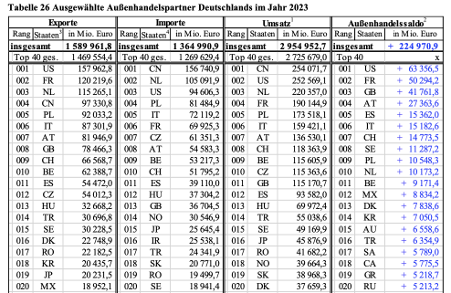

- Die Top 20 der größten Importländer werden in der untenstehenden Tabelle dargestellt (BLE, 2024, S. 104). Die Darstellung basiert auf den höchsten Summen in Millionen Euro. 
- Demnach importiert Deutschland die meisten Milch und Milcherzeugnisse aus China, den Niederlanden und den United States.

  

 

---

  

## Referenzen
- BLE. (2024). *Bericht zur Markt- und Versorgungslage mit Milch und Milcherzeugnissen.* <https://www.bmel-statistik.de/fileadmin/daten/0611100-2024.pdf>
