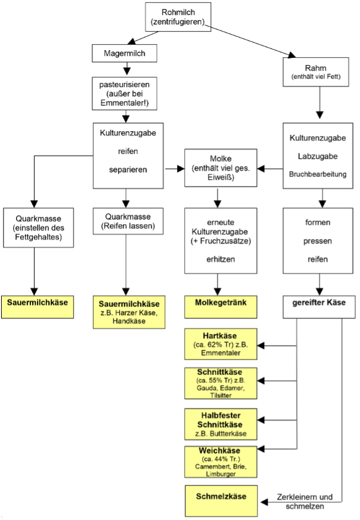

## Käseherstellung
- Es gibt verschiedene Sorten von Käse, die unterschiedlich hergestellt werden. Folgendes Schaubild gibt eine Übersicht (Freies Lehrbuch Biologie: 07.01 Bakterien und Milchprodukte, 2021):

  

 

---

  

## Referenzen
- *Freies Lehrbuch Biologie: 07.01 Bakterien und Milchprodukte.* (2021, November 1). <https://hoffmeister.it/index.php/freies-biologiebuch-fuer-schueler-und-studenten/97-freies-lehrbuch-biologie-07-01-bakterien-und-milchprodukte>
