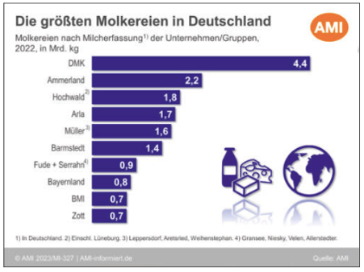
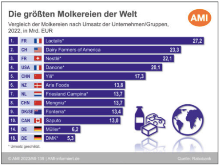

- Der Unterschied zwischen Molkereien und Käsereien liegt darin, dass Käsereien nur Käse produzieren und Molkereien auch andere Produkte neben Käse, wie zum Beispiel Sahne, Butter und Joghurt (MIV Milchindustrie-Verband e.V., o. J.-d).
- Die Milch wird mit Milchsammeltankwagen bei den Milcherzeugern abgeholt und zu den Molkereien transportiert. In der Molkerei wird dann die Milch zu verschiedenen Milchprodukten verarbeitet (MIV Milchindustrie-Verband e.V., o. J.-d).
- "Die Rohstoffe Milch und Rahm werden von den Molkereien bearbeitet und/oder verarbeitet und die Zwischenprodukte in die weiterverarbeitende Industrie geleitet oder die Endprodukte über den Handel den Verbrauchern zugeführt." (BLE, 2024, S. 148).

## Akteurs Infos
- Die folgenden beiden Grafiken zeigen die größten Molkereien in Deutschland sowie Weltweit 2022 (Situationsbericht 2023/24 Trends und Fakten zur Landwirtschaft, 2023, S. 32):

  

  

 

---

  

## Referenzen
- BLE. (2024). *Bericht zur Markt- und Versorgungslage mit Milch und Milcherzeugnissen.* <https://www.bmel-statistik.de/fileadmin/daten/0611100-2024.pdf>
- MIV Milchindustrie-Verband e.V. (o. J.-d). *Molkerei.* MIV Milchindustrie-Verband e.V. Abgerufen 16. Dezember 2024, von <https://milchindustrie.de/milkipedia/molkerei/>
- Deutscher Bauernverband (with Pascher, D. P., & Rukwied, J.). (2023). *Situationsbericht 2023/24 Trends und Fakten zur Landwirtschaft* (1. Auflage). Deutscher Bauernverband e.V. <https://magazin.diemayrei.de/storage/media/1ee9439f-5412-69f0-b9b1-5254a201e2da/DBV_SB_2024-web.pdf>
