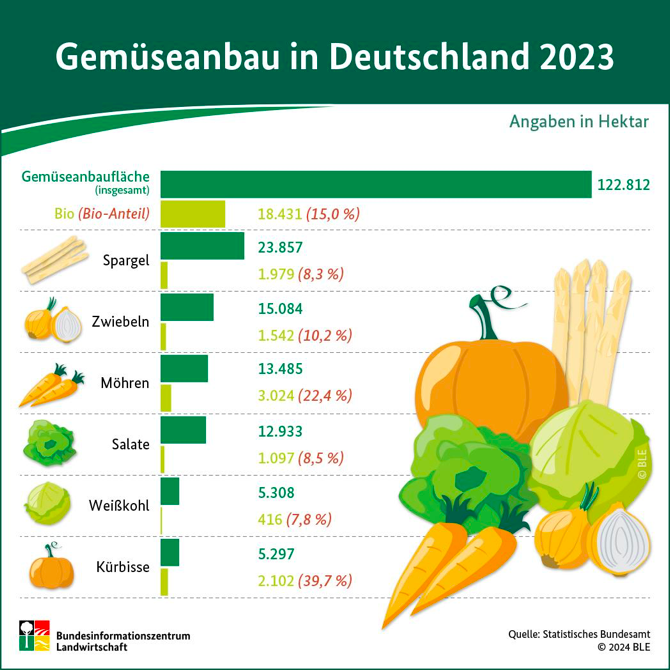
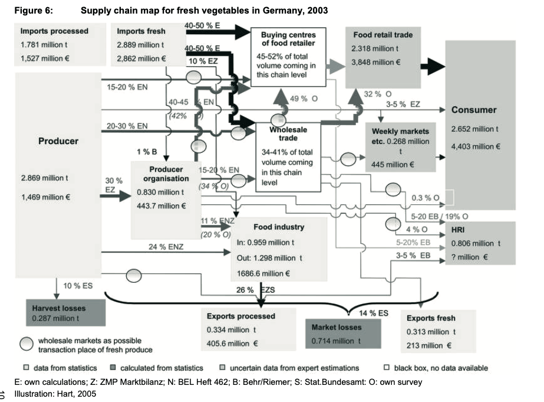

- **Wurzelgemüse Definition:** "Wurzelgemüse sind fleischig verdickte Speicherwurzeln. Botanisch werden sie als Rüben bezeichnet. Typische Vertreter dieser Gruppe sind **Möhren, Rettich, Schwarzwurzel, Pastinaken oder die Süßkartoffel.**" (Gesa Maschkowski & Rüdiger Lobitz, 2022)

## Möhren und Karotten
- Der Unterschied zwischen Möhren und Karotten liegt rein im Aussehen, denn es gibt keinen botanischen Unterschied. Es sind lediglich verschiedene Begriffe für das gleiche Gemüse. 
- Möhren sind oft längliche, walzenförmige bis spitze Rüben.
- Karotten sind meist rundliche, kurze, dicke Rüben. 
(Lobitz, 2022)

## Gemüseanbau
In Deutschland werden verschiedene Gemüsearten angebaut, in folgender Grafik wird eine Übersicht dargestellt:

  

(Bundesinformationszentrum Landwirtschaft, o. J.)

Möhren sind eins der am meisten angebauten Gemüsesorten (nach Anbaufläche) in Deutschland und können regional angebaut werden und sind fast das ganze Jahr verfügbar. Sie sind eins der am beliebtesten Wintergemüse (Jarrens, o. J.).

Zusätzlich ist zwischen der Gemüseanbaufläche im Freiland und im geschützten, zum Beispiel in Gewächshäusern oder unter hohen begehbaren Schutzabdeckungen zu unterscheiden. Möhren werden in Deutschland im Freiland angebaut. Hier ist außerdem eine Unterscheidung zwischen einem ökologischen und konventionellen Anbau möglich (Klockgether et al., 2016).

Ebenso ist es wichtig, dass Gemüsekulturen im Freilandanbau in einer Art Fruchtfolge angebaut werden. Dass heißt, das jedes Jahr ein anderes Gemüse angebaut wird, um spezifische Krankheiten und Schädlinge minimal zu halten. Der Boden soll nicht jedes Jahr auf die gleiche Art und Weise beansprucht werden (Landwirtschaft verstehen, o. J.).

## Möhren
- Da Möhren eins der am meisten angebauten Gemüsesorten in Deutschland sind, werden die Möhren repräsentativ für die Gruppe der Wurzelgemüse ausgewählt und in Detail beleuchtet (Bundesinformationszentrum Landwirtschaft, 2022).
- Möhren gehören zu den meistverzehrten Gemüsearten in Deutschland (Garming, 2023).
- Eine Möhre besteht aus dem Herz und der Rinde, dabei ist das Herz das innere der Möhre (Bundesinformationszentrum Landwirtschaft, 2022).
- Kartoffeln werden ebenfalls separat betrachtet in einem eigenen Schaubild. 

## Wertschöpfungskette
Eine erste Idee der Wertschöpfungskette für Möhren bietet folgende Abbildung von Hart et al. (2007, S. 10):

  

 

---

  

## Referenzen
- Bundesinformationszentrum Landwirtschaft. (o. J.). *Gemüseanbau in Deutschland 2023.* Abgerufen 12. Februar 2025, von <https://www.landwirtschaft.de/infothek/infografiken/uebersicht-aller-infografiken/gemueseanbau-in-deutschland-2022>
- Bundesinformationszentrum Landwirtschaft. (2022). *Möhren.* Bundesanstalt für Landwirtschaft und Ernährung. <https://www.ble.de/SharedDocs/Downloads/DE/Ernaehrung-Lebensmittel/Vermarktungsnormen/VermarktungsnormenObstGemuese/Flyer/Moehren.pdf?__blob=publicationFile&v=3>
- Garming, H. (2023). *Steckbriefe zum Gartenbau in Deutschland: Gemüsebau.* Thünen-Institut für Betriebswirtschaft. <https://www.thuenen.de/media/ti-themenfelder/Pflanzenproduktion/Gartenbau/2023-10-17_Steckbrief_Gemuesebau.pdf>
- Gesa Maschkowski & Rüdiger Lobitz. (2022, Oktober 22). *Gemüse: Frisch und Gesund.* Bundeszentrum für Ernährung. <https://www.bzfe.de/lebensmittel/lebensmittelkunde/gemuese/>
- Hart, V., Kavallari, A., Schmitz, M., & Wronka, T. C. (2007). Supply Chain Analysis of Fresh Fruit and Vegetables in Germany. *Zentrum Für Internationale Entwicklungs- Und Umweltforschung Der Justus-Liebig-Universität Gießen.* <https://jlupub.ub.uni-giessen.de/server/api/core/bitstreams/99850d4f-fb74-4433-8c8f-c96976b032f3/content>
- Jarrens, B. K. (o. J.). *Möhren.* Landwirtschaftskammer Schleswig-Holstein. Abgerufen 25. Februar 2025, von <https://www.lksh.de/landwirtschaft/ackerkulturen-von-ackerbohnen-bis-zwischenfruechte/moehren?tx_news_pi1%5BcurrentPage%5D=0&cHash=97a2de4aa944b6e8253a335eb0c986b4>
- Klockgether, K., Dirksmeyer, W., & Garming, H. (2016). Entwicklung des Gemüsebaus in Deutschland von 2000 bis 2015: Anbauregionen, Betriebsstrukturen, Gemüsearten und Handel. *Thünen Working Paper 56.* <https://doi.org/10.3220/WP1461137491000>
- Landwirtschaft verstehen. (o. J.). *Gemüseproduktion: Anbau, Pflanzsysteme, Krankheiten & Schädlinge.* Abgerufen 17. Februar 2025, von <https://www.landwirtschaft-verstehen.at/landwirtschaft-fuer-alle/weg-der-lebensmittel/wurzel-und-knollengemuese/gemueseproduktion?iframe=true&cHash=a1e62ae45cdb69ffc633b907139d5478>
- Lobitz, R. (2022, Februar 11). *Von Möhren und Karotten.* Bundeszentrum für Ernährung. <https://www.bzfe.de/service/news/aktuelle-meldungen/news-archiv/meldungen-2022/november/von-moehren-und-karotten/>
