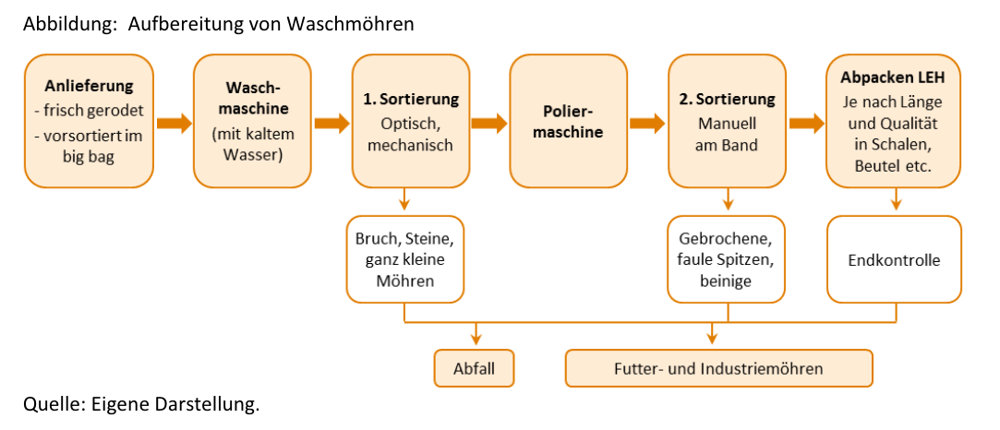

- Die Möhrenaufbereitung umfasst mehrere Schritte, diese sind ebenfalls in folgender Abbildung zu erkennen (Klockgether, 2016, S. 2):		

1. Waschen
2. Sortieren
3. Qualitätscheck
4. Verpacken

  

- Die unterschiedlichen Schritte werden oft von unterschiedlichen Betrieben durchgeführt, so gibt es Waschbetriebe, Sortierbetriebe, Kontrollbetriebe (Qualitätsprüfung), und Handelsbetriebe. Die Betriebe spezialisieren sich auf einen Schritt. Selten finden diese Schritte direkt beim Erzeuger statt (Meyer et al., 2018). 
- Möhren werden in zwei verschiedenen Wegen vermarktet: Zum einen die Möhren, welche in frischer Form genutzt werden, zum anderen die Möhren, welche weiterverarbeitet werden. Frische Möhren gehen nach der Möhrenaufbereitung direkt weiter in den Verkauf und die Distribution (Garming, 2023; Klockgether et al., 2016)

## Sortierung
- Bei diesem Schritt werden die Möhren nach Form und Größe sortiert. 

## Qualitätscheck
- Dieser Schritt wird oft gleichzeitig mit der Sortierung durchgeführt (entweder maschinell oder in Handarbeit). Zu kleine/zu große, Möhren mit zwei Beinen, sowie zu dicke Möhren werden aussortiert, da sie nicht mehr als Frischmöhren in den Einzelhandel kommen. 
- Ebenso werden gebrochene Möhren aussortiert. 
- Die aussortierten Möhren werden entweder als Futtermöhren für Pferde und Rinder verkauft, an Biogasanlagen vermarktet oder teilweise an Safthersteller geliefert. Dies geschieht zu einem geringeren Preis als Frischmöhren für den Lebensmitteleinzelhandel (Land schafft Leben, o. J.). Safthersteller verwerten aussortierte Möhren sogar LKW-weise als Schüttgut (Klockgether, 2016). 
- Es wird angenommen, dass ungefähr 7-10% der Möhren als Industrie- und Futtermöhren verwendet werden, da sie aussortiert wurden. Experten vermuten, dass diese oft jedoch verzehrfähig sind, jedoch nicht den Schönheitsidealen der Verbraucher entsprechen (Klockgether, 2016). 
- In der EU gilt der allgemeine Vermarktungsform für Gemüse, welche im folgenden Bild gezeigt wird (Meyer et al., 2018, S. 13): 

  

- Faktoren die die Qualität beeinflussen (Klockgether, 2016):

1. Bodengesundheit, Witterung, und Bewässerung,
2. Schädlingsbefall, und zugelassene Pflanzenschutzmittel,
3. Erntetechnik und Erntezeitpunkt. 

## Verpackung
- Die übliche Verpackung für Möhren (Waschmöhren), welche als Rohkost in den Lebensmitteleinzelhandel gehen, sind Kunststoffsäcke mit kleinen Löchern. Diese können ein Gewicht von 0,5 - 5,0 kg tragen. Am häufigsten wird der 1kg Sack verwendet (Land schafft Leben, o. J.). 

 

---

  

## Referenzen
- Garming, H. (2023). *Steckbriefe zum Gartenbau in Deutschland: Gemüsebau.* Thünen-Institut für Betriebswirtschaft. <https://www.thuenen.de/media/ti-themenfelder/Pflanzenproduktion/Gartenbau/2023-10-17_Steckbrief_Gemuesebau.pdf>
- Klockgether, K. (2016). *Was tun mit krummen Möhren?* [Thünen-Institut für Betriebswirtschaft]. <https://www.thuenen.de/media/ti-themenfelder/Pflanzenproduktion/Gartenbau/Interview_Klockgether.pdf>
- Klockgether, K., Dirksmeyer, W., & Garming, H. (2016). Entwicklung des Gemüsebaus in Deutschland von 2000 bis 2015: Anbauregionen, Betriebsstrukturen, Gemüsearten und Handel. *Thünen Working Paper 56.* <https://doi.org/10.3220/WP1461137491000>
- Land schafft Leben. (o. J.). *Karotte Herstellung.* Abgerufen 17. Februar 2025, von <https://www.landschafftleben.at/lebensmittel/karotte/herstellung/wer-sie-wie-verarbeitet>
- Meyer, C. H., Hamer, M., Frieling, D., & Oertzen, G. (2018). *Lebensmittelverluste von Obst, Gemüse, Kartoffeln zwischen Feld und Ladentheke* (LANUV-Fachbericht 85). Landesamt für Natur, Umwelt und Verbraucherschutz. <https://www.lanuv.nrw.de/fileadmin/lanuvpubl/3_fachberichte/fabe85_Lebensmittelverluste_gesichert.pdf>
