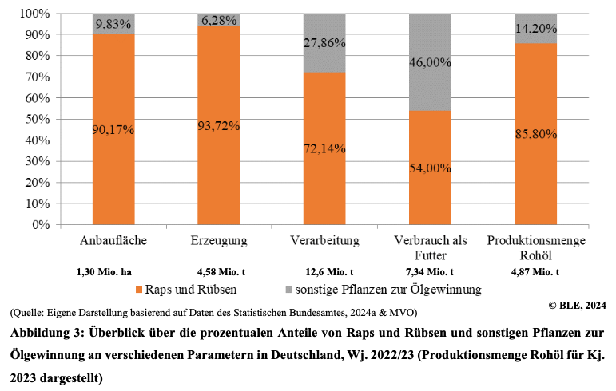
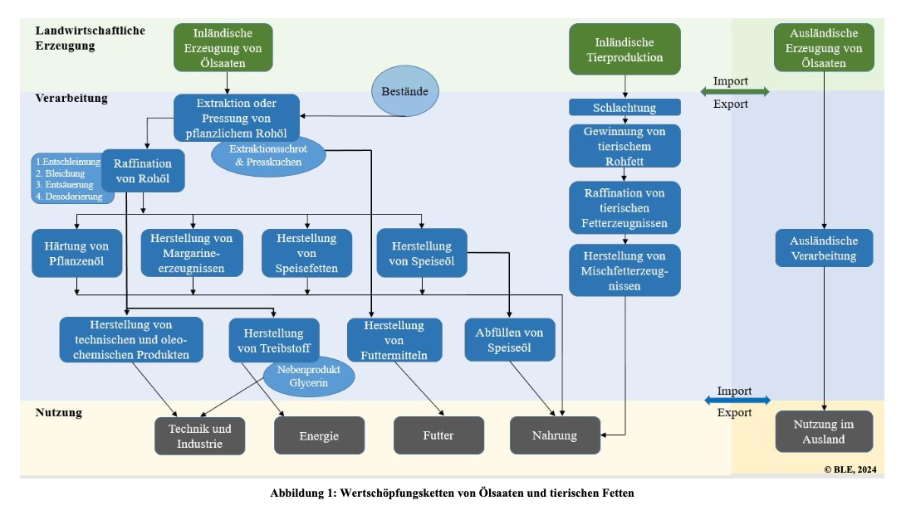
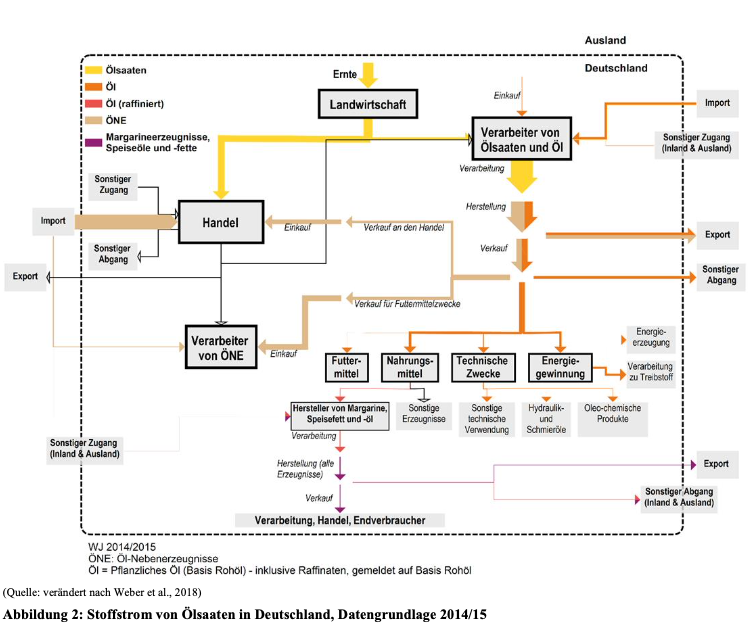
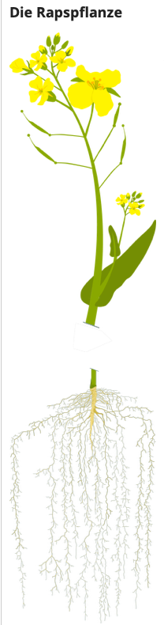

- Ölsaaten und Fette sind ein fundamentaler Bestandteil der menschlichen Ernährung. Dabei kann zwischen verschiedenen Arten von Ölen und Fetten unterschieden werden: Tierische Fette (Verarbeitung zu Schmalz und Talg) und Ölsaaten, besonders Raps in Deutschland (BLE, 2024).
- **Raps** ist die am meisten angebaute und **wichtigste Ölsaat in Deutschland** (BLE, 2024), weshalb im weiteren Verlauf der Fokus auf Raps gelegt wird. Dies wird auch in der folgenden Abbildung deutlich: 

  

(BLE, 2024, S. 8).

## Wertschöpfungskette
- Einen ersten Überblick über die Wertschöpfungskette von Ölsaaten und Fetten wird im folgenden Bild dargestellt (BLE, 2024, S. 6):

  

- Ebenso wird in dem Bericht über Ölsaaten eine Stoffstromanalyse abgebildet, welche ebenfalls relevant für die Ölsaaten Landschaft ist (BLE, 2024, S. 7):

  

## Was sind Ölsaaten?
"Ölsaaten sind Pflanzen, deren Samen der Erzeugung von Öl dienen. Dazu zählen unter anderem **Raps und Rübsen, Sonnenblumen, Sojabohnen und Öl-Lein (Leinsamen)**. Die weltweit bedeutendsten Ölsaaten sind Sojabohnen und Raps. In Deutschland haben Raps und Rübsen den größten Anteil am Anbau von Ölsaaten. Darauf folgen Sonnenblumen und Sojabohnen. Bei der Ölgewinnung bleiben Ölkuchen und –schrote als Nebenprodukt, auch Koppelprodukt genannt, übrig. Diese verfüttern Landwirtinnen und Landwirte als eiweißreiches Futtermittel an Nutztiere." (BMEL, o. J.). 

  

(Union zur Förderung von Oel- und Proteinpflanzen e. V., o. J.-c)

- **Blüte:** Sie lockt im Frühling Bienen an und blüht von Ende April bis Anfang Mai, circa 3 Wochen lang (Union zur Förderung von Oel- und Proteinpflanzen e. V., o. J.-c)
- **Rapsschote:** In ihr sind 15-18 Saatkörner, die einen Ölgehalt von 40-45% haben. Pro Hektar liegt der Ertrag bei 3.5-4.5 Tonnen Rapssaat. 1 Hektar Raps ist genug Proteinfutter (aufgrund der hochwertigen Eiweiß- und Rohfasern) für 3 Milchkühe für ein gesamtes Jahr (Union zur Förderung von Oel- und Proteinpflanzen e. V., o. J.-c)
- **Stängel:** Nach der Ernte bleiben die gedroschenen Stängel (ca. 10 Tonnen pro Hektar) als Trockenmasse auf dem Feld zurück. Sie dienen als natürliches Düngemittel und fördern den Humusaufbau (Union zur Förderung von Oel- und Proteinpflanzen e. V., o. J.-c).
- **Wurzel:** Die Wurzel dringt bis zu 1,8 Meter tief in den Boden ein und ist stark verwurzelt, weshalb sie den Boden lockert und durchlüftet (Union zur Förderung von Oel- und Proteinpflanzen e. V., o. J.-c).

- Durch den Anbau von Raps wird Stickstoff im Boden gespeichert (1 Hektar Raps speichert rund 220kg Stickstoff) (Union zur Förderung von Oel- und Proteinpflanzen e. V., o. J.-c).
- Raps wird im August/September ausgesät, überwintert auf dem Feld und wird im Folgejahr im Juli geerntet. Daher ist eine durchgängige Bedeckung des Bodens im Winter gewährleistet, welches Erosion vorbeugt (Union zur Förderung von Oel- und Proteinpflanzen e. V., o. J.-c). Die Aussaat findet mit einer Sämaschine statt, die alle 2-3 cm millimetergroße Samen in den Boden legt (Union zur Förderung von Oel- und Proteinpflanzen e. V., o. J.-a).
- Raps wächst besser, wenn es während des Anbaus mindestens einmal unter 5°C ist. Dies nennt sich **Vernalisation**, eine positive Reaktion auf Kältereize (Union zur Förderung von Oel- und Proteinpflanzen e. V., o. J.-a).
- Die optimalen Gegebenheiten von Raps können anhand der 40-9-2 Regel erklärt werden: 40% Ölgehalt, 9% Feuchte, und 2% Besatz (BLE, 2024).
- Das "Rapsjahr" (Union zur Förderung von Oel- und Proteinpflanzen e. V., o. J.-a):
 
August-September: Aussaat  
November-Februar: Überwintern  
Februar-März: Schossen - Düngung mit Stickstoff, welches ein schnelles Wachstum fördert  
April-Mai: Blüte - drei bis vier Wochen lang blüht der Raps, dann werden aus den Blüten kleine grüne Schoten, in denen die Rapskörner wachsen. In diesem Zusammenhang wirft der Raps seine Blätter auf den Boden ab.  
Juli: Ernte - Circa 2 Monate nach der Blüte wird der Raps geerntet. Wo vorher grüne Schoten waren, sind nun dünne bräunliche Schoten, die bis zu 10cm lang sind. Sie haben jeweils 15-18 millimetergroße kugelige Samen, die bei völliger Reife schwarz sind. Raps wird mit einem Mähdrescher geerntet.  

## Rapsöl

- Rapsöl hat 33% mehrfach ungesättigte Fettsäuren, 60% einfach ungesättigte Fettsäuren, und 7% gesättigte Fettsäuren (OVID Verband der Ölsaatenverarbeitenden Industrie in Deutschland e. V., 2018). Außerdem ist es reich an Vitamin E (OVID Verband der Ölsaatenverarbeitenden Industrie in Deutschland e. V., o. J.-d).
- Erst durch die Anwendung von zum Beispiel Rapsöl kann der Körper fettlösliche Vitamine wie A, D, E, und K nutzen. Ebenfalls bekommt der Körper eine gute Kombination von Fettsäuren, welche den Cholesterinspiegel in Balance halten (OVID Verband der Ölsaatenverarbeitenden Industrie in Deutschland e. V., 2018).
- Rapsöl ist sei 2009 die Nummer 1 im deutschen Lebensmittelhandel (Specht, 2020).

 

---

  

## Referenzen
- BLE. (2024). *Bericht zur Markt- und Versorgungslage Ölsaaten, Öle und Fette—2024.* <https://www.bmel-statistik.de/fileadmin/daten/0611030-2024.pdf>
- BMEL. (o. J.). *Ölsaaten.* BMEL-Statistik. Abgerufen 17. Mai 2025, von <https://www.bmel-statistik.de/landwirtschaft/bodennutzung-und-pflanzliche-erzeugung/oelsaaten>
- OVID Verband der Ölsaatenverarbeitenden Industrie in Deutschland e. V. (o. J.-d). *Raps: Gelb und vielfältig.* Ovid-Verband.de. Abgerufen 17. Mai 2025, von <https://www.ovid-verband.de/unsere-themen/oelsaaten/raps>
- OVID Verband der Ölsaatenverarbeitenden Industrie in Deutschland e. V. (2018). *10 Fakten: Ölsaaten und ihre Produkte.* Ovid-Verband.de. <https://www.ovid-verband.de/fileadmin/user_upload/Hintergrundpapiere/2018_10_Fakten_%C3%BCber_die_Welt_der_%C3%96lsaaten.pdf>
- Specht, M. (2020, Dezember 10). *Herausforderungen für den Raps- und Körnerleguminosenanbau: Was ist zu erwarten?* <https://www.landwirtschaft.sachsen.de/download/20201210_Specht_Raps_Koernerlegus_LfULG_Pflanzenschutz.pdf>
- Union zur Förderung von Oel- und Proteinpflanzen e. V. (o. J.-a). *Der Raps auf dem Feld.* UFOP.de. Abgerufen 12. Juni 2025, von <https://www.ufop.de/agrar-info/verbraucher-info/wo-waechst-das-rapsoel/der-raps-auf-dem-feld/>
- Union zur Förderung von Oel- und Proteinpflanzen e. V. (o. J.-c). *Raps – vom Feld in unseren Alltag.* UFOP.de. Abgerufen 12. Juni 2025, von <https://www.ufop.de/agrar-info/verbraucher-info/steckbriefe/raps/>
