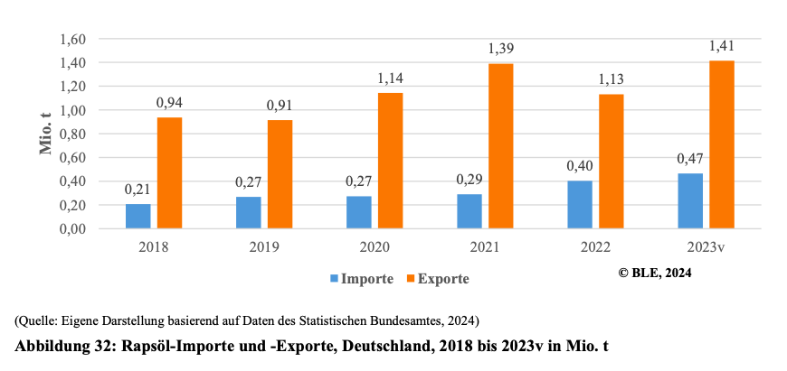

- Auch aufgrund des geringen SVG (<50%), spielt der Export nur eine sehr geringe Rolle, besonders bei Ölsaaten, die noch nicht verarbeitet sind (BLE, 2024).

  

(BLE, 2024, S. 35)

- Die Exportzahlen sind etwas höher bei verarbeiteten Produkten, wie etwa Rapsöl, hier ist Deutschland Nettoexporteur (BLE, 2024, S. 37):

  

  

- Das meiste Rapsöl wird an europäische Nachbarländer exportiert (51% Niederlande, 12% Belgien), welches unter anderem darauf zurückzuführen ist, dass beide Länder große Häfen haben, über die das Rapsöl in alle Welt exportiert werden kann. Dies ist jedoch nicht in der Statistik aufgeführt (BLE, 2024).

 

---

  

## Referenzen
- BLE. (2024). *Bericht zur Markt- und Versorgungslage Ölsaaten, Öle und Fette—2024.* <https://www.bmel-statistik.de/fileadmin/daten/0611030-2024.pdf>
