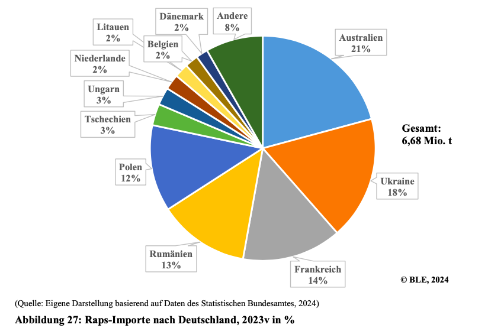

- Da der SVG von Ölsaaten und Raps unter 50% lag (2022/2023) ist Deutschland auf Importe angewiesen (BLE, 2024). 
- 2023 wurden 9,6 Millionen Tonnen Ölsaaten importiert, davon waren 5,7 Millionen Tonnen Raps und Rübsen überwiegend aus Australien, der Ukraine, und Frankreich (BLE, 2024).

  

(BLE, 2024, S. 35).

- Auch bei Pflanzenölen ist Deutschland auf Importe angewiesen (BLE, 2024).
**BILD EINFÜGEN**

(BLE, 2024, S. 34)

 

---

  

## Referenzen
- BLE. (2024). *Bericht zur Markt- und Versorgungslage Ölsaaten, Öle und Fette—2024.* <https://www.bmel-statistik.de/fileadmin/daten/0611030-2024.pdf>
