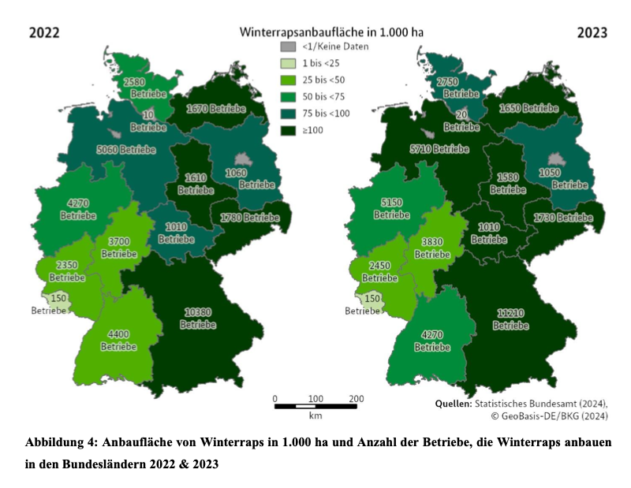
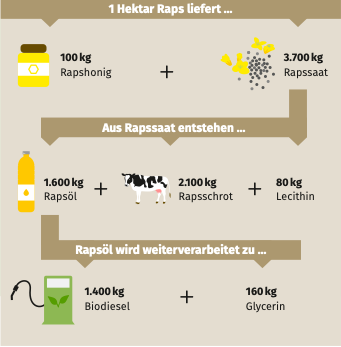

- Raps ist die wichtigste Ölsaat in Deutschland und ihr Anbau verzeichnet seit 2003 einen stetigen Anstieg, welches unteranderem damit zusammenhängt, dass Raps auch zur Biodieselherstellung genutzt wird (BLE, 2024).
- Neben Raps werden in Deutschland auch (in geringerer Menge) Sonnenblumenkerne, Sojabohnen, Senf, Mohn, Ölrettich und Leinsaat angebaut (BLE, 2024).
- Raps wird überwiegend als **Winterraps** in Deutschland angebaut, was so viel bedeutet, wie der Raps wird im Herbst ausgesät, überwintert auf dem Feld und wird im Juni/Juli des folgenden Jahres geerntet (BLE, 2024).

## Anbauflächen und -regionen
- In Deutschland werden auf 1,178 Millionen Hektar Raps (fast ausschließlich Winterraps) angebaut (BLE, 2024). Dies entspricht ungefähr 7% der landwirtschaftlichen Nutzfläche in Deutschland (BMEL, o. J.).
- Mecklenburg-Vorpommern hat die größte Anbaufläche von Raps in Deutschland (205.400 Hektar), gefolgt von Sachsen-Anhalt (137.200 Hektar), **Niedersachsen (115.000 Hektar)**, und Sachsen (113.000 Hektar) (BLE, 2024, S. 9).

  

## Rapszahlen
- Laut dem Deutschen Raiffeisenverband lag die Erntemenge von Raps 2024 bei 3,93 Millionen Tonnen (BLE, 2024). Das BMEL schätzt die Erntemenge auf 3,6 Millionen Tonnen (BMEL, o. J.).
- Im Jahr 2024 bauten 41.400 Betriebe Winterraps an (BMEL, o. J.).
- Der mittlere Erzeugerpreis für Raps lag 2023/2024 bei 409€/Tonne, welches einen deutlichen Rückgang zum Vorjahr darstellt (-46%) (BLE, 2024).
- Auf einem Hektar Raps ist ein durchschnittlicher Ertrag von 3,4 Tonnen Rapssamen, woraus 1.450 Liter Rapsöl entstehen, die wiederum 1.400 Liter Biodiesel liefern (Bundesinformationszentrum Landwirtschaft, 2024). 
- Diese Daten werden ebenfalls in einer Abbildung des OVID dargestellt (OVID Verband der Ölsaatenverarbeitenden Industrie in Deutschland e. V., 2018, S. 6):

  

 

---

  

## Referenzen
- BLE. (2024). *Bericht zur Markt- und Versorgungslage Ölsaaten, Öle und Fette—2024.* <https://www.bmel-statistik.de/fileadmin/daten/0611030-2024.pdf>
- BMEL. (o. J.). *Ölsaaten.* BMEL-Statistik. Abgerufen 17. Mai 2025, von <https://www.bmel-statistik.de/landwirtschaft/bodennutzung-und-pflanzliche-erzeugung/oelsaaten>
- Bundesinformationszentrum Landwirtschaft. (2024, August 10). *Auf fast zehn Prozent unserer Äcker wächst Raps.* Landwirtschaft.de. <https://www.landwirtschaft.de/infothek/landwirtschaft-in-zahlen/pflanze/auf-fast-zehn-prozent-unserer-aecker-waechst-raps>
- OVID Verband der Ölsaatenverarbeitenden Industrie in Deutschland e. V. (2018). *10 Fakten: Ölsaaten und ihre Produkte.* Ovid-Verband.de. <https://www.ovid-verband.de/fileadmin/user_upload/Hintergrundpapiere/2018_10_Fakten_%C3%BCber_die_Welt_der_%C3%96lsaaten.pdf>
- Thuneke, K., & Remmele, E. (2007, Januar). *Production and Utilisation of Rapeseed Oil Fuel in Germany.* 6th International Colloquium Fuels, Stuttgart, Germany. <https://www.tfz.bayern.de/mam/cms08/en/dateien/productionandutilisationrapeseedoilingermany_fuelstae2007_th.pdf>
