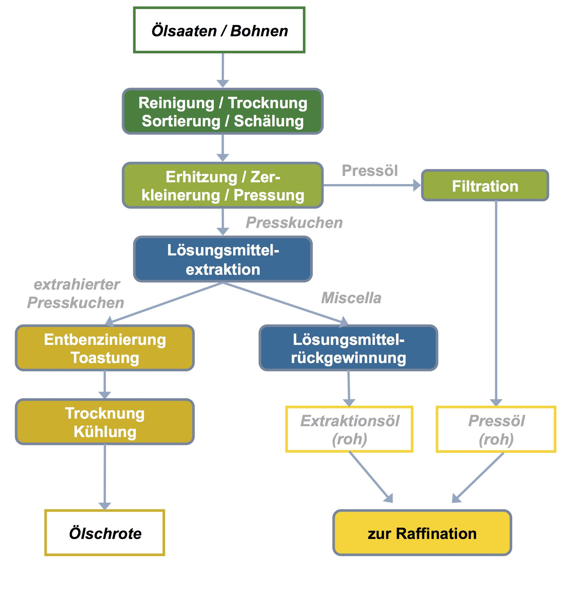
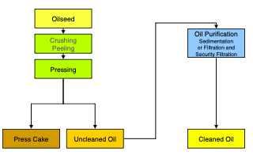
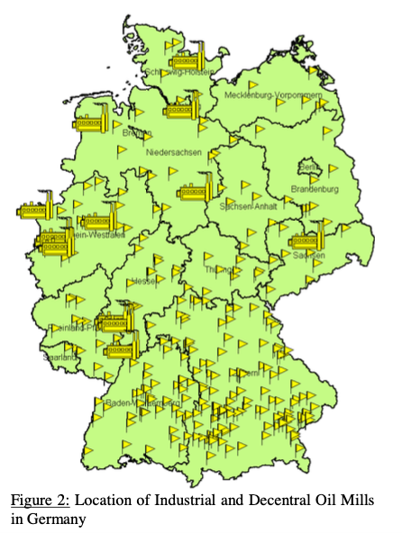
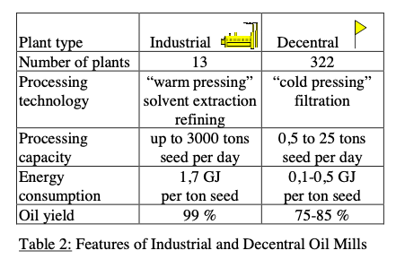

- Pflanzenöl kann durch zwei Verfahren hergestellt werden (BLE, 2024): 

1. **Kaltpressverfahren** (auch **Pressöl** genannt), und
2. **Extraktionsöl**

- Die folgende Grafik zeigt eine Übersicht über die Schritte beider Verfahren, welche im weiteren Verlauf detaillierter beschrieben werden (OVID Verband der Ölsaatenverarbeitenden Industrie in Deutschland e. V., o. J.-a):

  

## Pressöl
- Bei diesem Verfahren wird das Öl durch mechanischen Druck und einer Temperatur von maximal 40°C in Ölmühlen (meist dezentral) aus der Saat gepresst. Dabei entsteht ein natives Öl und Presskuchen (Nebenprodukt, auch Rapskuchen genannt) (BLE, 2024; Union zur Förderung von Oel- und Proteinpflanzen e. V., o. J.-c).
- Bei dem Pressölverfahren werden zwischen 88-90% des Öls extrahiert (Thuneke & Remmele, 2007).

  

(Thuneke & Remmele, 2007, S. 3).

## Exkrationsöl
- Überwiegend von zentralen und industriellen Ölmühlen durchgeführt. Die Ölsaaten werden verarbeitet, und nach einer Vorbehandlung gepresst. Dies geschieht bei höheren Temperaturen im Gegensatz zum Pressöl. Nach diesem Vorgang entstehen Öl und Ölschrot (Nebenprodukt, auch Rapsschrot genannt) (BLE, 2024; Union zur Förderung von Oel- und Proteinpflanzen e. V., o. J.-c).
- In einem weiteren Schritt wird das restliche Öl aus den Ölpresskuchen extrahiert. Hierzu werden die Presskuchen mit Lösungsmitteln auf bis zu 80°C erhitzt, um das letzte Öl zu extrahieren (BLE, 2024). Bei diesem Verfahren werden bis zu 99% des Öls extrahiert (Thuneke & Remmele, 2007).
- Extraktionsöl wird mit Chemikalien (Hexane) hergestellt, welches bei der Herstellung von Pressöl nicht gebraucht wird (Engelmann et al., 2014). Damit Hexan nicht im Öl ist, muss dieses dann erhitzt werden, denn erst bei hohen Temperaturen verdampft Hexan. Dies verändert auch die Qualität des übrigbleibenden Schrots (Frauenhofer CBP, 2023).
- Bitterstoffe aus den Schalen bleiben im Schrot (Frauenhofer CBP, 2023).
- Am Ende hat man Öl mit Begleitstoffen und Extraktionsschrot (BLE, 2024).

  

(Thuneke & Remmele, 2007, S. 3).

## Ölmühlen Zahlen und Standorte
- In Deutschland gibt es 13 industrielle und 300 dezentrale Ölmühlen, diese werden auf der folgenden Karte dargestellt (Thuneke & Remmele, 2007, S. 2 & 3):

  

  

- Weitere Infos über Ölmühlen Akteure sind auf der Seite "Verarbeitungsschritte", da die oben genannten Informationen bereits etwas älter sind.

## Herstellungsschritte von Öl
Die folgende Auflistung der Herstellungsschritte von Öl basiert auf den Informationen des Verbands der Ölsaatenverarbeitenden Industrie in Deutschland (OVID Verband der Ölsaatenverarbeitenden Industrie in Deutschland e. V., o. J.-a):

1. **Reinigung, Trocknung, Schälung:**

- Fremdbestandteile wie Steine, Metall, und Glas werden durch Siebe und Magnete herausgetrennt.
- Einige Ölsaaten müssen geschält werden, wie Soja oder Sonnenblumenkerne. Dies verringert den Rohfasergehalt im Schrot, im Umkehrschluss erhöht es also den Proteingehalt des Schrots.
- Die Schalen können weiterverwendet werden und mit Wasserdampf zu Pallets gepresst werden.

2. **Erhitzung, Zerkleinerung, Pressung:**

- Die Saat wird mit Hilfe von Walzenstühlen zerkleinert und anschließend erhitzt.
- Beim mechanischen Pressen findet dies mit Schneckenpressen statt.
- Die Presskuchen werden mit Lösemitteln vermengt, um das restliche Öl zu extrahieren und letztlich gefiltert, um die Rohfasern abzutrennen.

3. **Extraktion:**

- Die mehrfache Destillation von Pflanzenöl mit Lösemitteln führt zu Extraktionsöl.

4. **Schrotgewinnung:**

- Die Presskuchen werden durch eine direkte Dampfzugabe indirekt erwärmt. Sie werden quasi getoastet.
- Getoastete Presskuchen sind besser verdaulich, werden dann jedoch noch getrocknet (abwechselnd heiße und kalte Luftzufuhr) und gekühlt.
- Abschließend können sie dann vermahlt werden oder zu Pallets verarbeitet werden.

 

---

  

## Referenzen
- BLE. (2024). *Bericht zur Markt- und Versorgungslage Ölsaaten, Öle und Fette—2024.* <https://www.bmel-statistik.de/fileadmin/daten/0611030-2024.pdf>
- Engelmann, K., Dressler, D., Strimitzer, L., Thuneke, K., & Remmele, E. (2014, Juni). *Life Cycle Assessment of Rapeseed Oil as self-sufficient agricultural Biofuel—Results of case studies from Bavaria.* 22nd European Biomass Conference and Exhibition, Hamburg, Germany. <https://www.tfz.bayern.de/mam/cms08/en/dateien/lcarapeseedoilfuelcasestudiesbavaria_biomasshamburg2014_eg.pdf>
- Frauenhofer CBP. (2023, Mai 3). *Nicht nur Öl, auch Proteine aus Raps.* Fraunhofer-Zentrum für Chemisch-Biotechnologische Prozesse CBP. <https://www.cbp.fraunhofer.de/de/presse-und-medien/2023/nicht-nur-oel-auch-proteine-aus-raps.html>
- OVID Verband der Ölsaatenverarbeitenden Industrie in Deutschland e. V. (o. J.-a). *Die Ölsaatenverarbeitung.* Ovid-Verband.de. Abgerufen 17. Mai 2025, von <https://www.ovid-verband.de/unsere-themen/verarbeitung/oelsaatenverarbeitung>
- Thuneke, K., & Remmele, E. (2007, Januar). *Production and Utilisation of Rapeseed Oil Fuel in Germany.* 6th International Colloquium Fuels, Stuttgart, Germany. <https://www.tfz.bayern.de/mam/cms08/en/dateien/productionandutilisationrapeseedoilingermany_fuelstae2007_th.pdf>
- Union zur Förderung von Oel- und Proteinpflanzen e. V. (o. J.-c). *Raps – vom Feld in unseren Alltag.* UFOP.de. Abgerufen 12. Juni 2025, von <https://www.ufop.de/agrar-info/verbraucher-info/steckbriefe/raps/>
