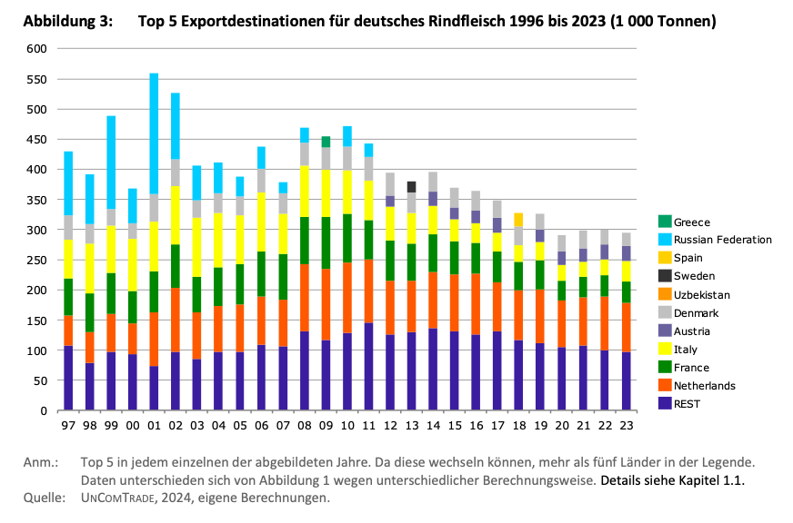

- Der Export von Fleisch und lebenden Rindern nach Deutschland findet überwiegend mit EU-Nachbarstaaten statt, vor allem den Niederlanden (22,1% der Exporte). Weitere wichtige Exportländer sind Italien (12,1%), Frankreich (11,9%) und Dänemark (8,1%) (BLE, 2025).
- In Deutschland weniger beliebte Rinderteile werden nach Ostasien exportiert, denn dort gelten sie als Delikatessen. Dazu zählen unter anderem Rinderfüße und -ohren sowie Innereien wie Mägen und Nieren (Fokus Fleisch Report zur deutschen Fleischwirtschaft, 2023).
- Der Handel mit Frankreich ist nennenswert, denn Deutschland importiert überwiegend Jungbullenfleisch aus Frankreich und exportiert Kuhfleisch nach Frankreich (Deblitz & Zavyalova, 2024).
- Die folgende Grafik zeigt eine Übersicht der Top Exportdestinationen von deutschem Rindfleisch (Deblitz & Zavyalova, 2024, S. 5):

  

- 2024 wurden 38,000 Tonnen Schlachtgewicht an lebenden Tieren exportiert und 551,000 Tonnen Schlachtgewicht an Fleisch exportiert (siehe folgende Abbildung, BLE, 2025, S. 19):

  

 

---

  

## Referenzen
- BLE. (2025). *Bericht zur Markt- und Versorgungslage mit Fleisch 2025.* <https://www.bmel-statistik.de/fileadmin/daten/0611090-2025.pdf>
- Deblitz, C., & Zavyalova, K. (2024). *Steckbriefe zur Tierhaltung in Deutschland: Mastrinder* (Steckbriefe zur Tierhaltung in Deutschland). Thünen-Institut für Betriebswirtschaft. <https://www.thuenen.de/media/ti-themenfelder/Nutztierhaltung_und_Aquakultur/Haltungsverfahren_in_Deutschland/Rindermast/Steckbrief_Mastrinder_2024.pdf>
- *Fokus Fleisch Report zur deutschen Fleischwirtschaft.* (2023). Fokus Fleisch. <https://www.fokus-fleisch.de/assets/uploads/downloads/fokus-fleisch-report-fleischwirtschaft_2023-05-24-131337.pdf>
