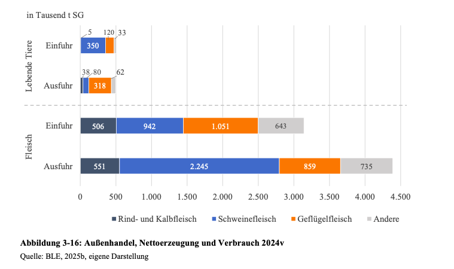

- Der Import von Fleisch und lebenden Rindern nach Deutschland findet überwiegend mit EU-Nachbarstaaten statt, vor allem den Niederlanden (24,2% der Importe). Weitere wichtige Importländer sind Polen (15,5%) und Österreich (14,9%) (BLE, 2025).
- Neben dem intra-europäischen Handel kommen Importe zusätzlich aus Argentinien und Uruguay (Deblitz & Zavyalova, 2024).
- Die folgende Grafik zeigt eine Übersicht der Herkunftsländer, aus denen Deutschland Rindfleisch importiert (Deblitz & Zavyalova, 2024, S. 5): 

  

- 2024 wurden 5000 Tonnen Schlachtgewicht an lebenden Tieren importiert und 506.000 Tonnen Schlachtgewicht an Fleisch importiert (siehe folgende Abbildung, BLE, 2025, S. 19):

  

 

---

  

## Referenzen
- BLE. (2025). *Bericht zur Markt- und Versorgungslage mit Fleisch 2025.* <https://www.bmel-statistik.de/fileadmin/daten/0611090-2025.pdf>
- Deblitz, C., & Zavyalova, K. (2024). *Steckbriefe zur Tierhaltung in Deutschland: Mastrinder* (Steckbriefe zur Tierhaltung in Deutschland). Thünen-Institut für Betriebswirtschaft. <https://www.thuenen.de/media/ti-themenfelder/Nutztierhaltung_und_Aquakultur/Haltungsverfahren_in_Deutschland/Rindermast/Steckbrief_Mastrinder_2024.pdf>
