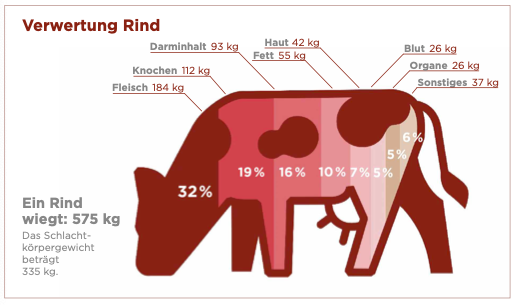

- Fast das gesamte Rind wird verwendet - von Filet und Steak bis hin zu Haut und Organen:

  

(Fokus Fleisch Report zur deutschen Fleischwirtschaft, 2023, S. 61).

 

---

  

## Referenzen
- *Fokus Fleisch Report zur deutschen Fleischwirtschaft.* (2023). Fokus Fleisch. <https://www.fokus-fleisch.de/assets/uploads/downloads/fokus-fleisch-report-fleischwirtschaft_2023-05-24-131337.pdf>
