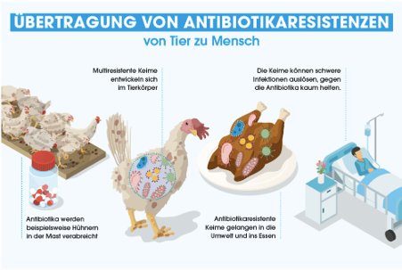

- **Maul- und Klauenseuche (MKS)** war Jahrzehnte lang nicht in Deutschland präsent und Deutschland galt als MKS frei. Am 10.01.2025 wurden im Landkreis Märkisch-Oderland in Brandenburg Wasserbüffel, die an MKS erkrankt waren, entdeckt. Niedersachsen ist bisher nicht von den Sperrzonen betroffen, jedoch verlor Deutschland den Status "MKS-frei", welches mit entsprechenden Handelseinschränkungen einhergeht (Niedersächsisches Landesamt für Verbraucherschutz und Lebensmittelsicherheit, 2025). 
"Die Maul- und Klauenseuche ist eine hochansteckende Virusinfektion der Klauentiere (Rinder, Schafe, Ziegen und Schweine). Auch Zoo- und Wildtiere können an MKS erkranken. Die Seuche ist weltweit verbreitet. Für den Menschen ist die Seuche ungefährlich. Seit 1988 war die Seuche nicht mehr in Deutschland aufgetreten." (BMEL, 2025).

- **Afrikanische Schweinepest - Seuchen & Krankheiten** (BZL, o. J.). Auch in Deutschland sind in einigen Bundesländern Schweine von der Afrikanischen Schweinpest betroffen gewesen. Da es eine Seuche ist müssen Fälle gemeldet werden und um den Fundort werden Sperrzonen und Beobachtungszonen eingerichtet. Bisher bleibt Niedersachsen seuchenfrei. Da Deutschland Fälle von der afrikanischen Schweinepest hat, verlor es den seuchenfreien Status und der Export nach China kam zum Erliegen, aufgrund eines Exportverbots (BLE, 2024). Infizierte Schweine müssen gekeult werden und auch danach bleibt das Virus für längere Zeiten nachweisbar im Fleisch (BLE, 2024).

- **Belastung des Fleisches mit Medikamentenrückständen**, insbesondere Antibiotikaresistenzen ist seit längerer Zeit im Fokus. In industriellen Tierställen gibt es häufig einen hohen Einsatz von Antibiotika, woraus sich folglich häufig Antibiotikaresistenzen bilden. Diese können durch das Fleisch vom Tier auf den Menschen übertragen werden. In 2022 wurden 540 Tonnen Antibiotika an Schweine, Puten, Hühner, Rinder und andere Tiere verabreicht (in Deutschland). Oft wird in der Massentierhaltung auch nicht nur ein betroffenes Tier mit Antibiotika behandelt, sondern meist der gesamte Bestand eines Stalles/einer Anlage, dies nennt sich Metaphylaxe und ist in Deutschland weiterhin erlaubt. 2014 wurden verschiedene Fleischproben im Labor analysiert und in 86% der 30 Hühner-/Putenproben wurden Resistenzen gegenüber Antibiotika entdeckt (Kainz, 2024).

  

- Die **Kastenstandhaltung von Sauen** dauert ungefähr 5,5 Monate des Jahres an (BMEL, 2023). Dies ist überwiegend der Fall, um Ferkel vor dem Erdrücken zu schützen und während der Besamung. Tierschützer sind gegen eine Kastenstandhaltung. Ab 2029 tritt eine neue Regel in Kraft, wo die Sauen nicht mehr für so lange Zeiträume in einer Kastenstandhaltung gehalten werden dürfen. Es kann nicht direkt umgesetzt werden, da der Umbau für die Landwirte sehr teuer ist.

- Das **Kupieren von Schwänzen** bedeutet den Schwanz des Schweines abzuschneiden und somit Schwanzbeizen zu verhindern (BMEL, 2023). Tierschützer sehen das eigentliche Problem hinter den Beweggründen der Schweine die Schwänze zu beißen: Das Leid der Tiere in den Haltungsbedingungen, Belegdichte, Stallklima, Beschäftigungsmaterial und Fütterung. Das Auftreten von Schwanzbeißen kann also als ein wichtiger Tierschutzindikator betrachtet werden, da Schweine mit unkupierten Schwänzen nur unter sehr guten Haltungsbedingungen gehalten werden können. Laut dem europäischen und deutschen Tierschutzgesetz dürfen die Schwänze nur in Ausnahmefällen kupiert werden.

- **Erhöhte Umgebungstemperaturen** machen Schweinen je nach Gewicht zu schaffen. Insbesondere deshalb, weil sie keine Schweißdrüsen haben, sondern runterkühlen durch vermehrtes Atmen (BLE, 2024).

- **MMA-Komplexe** bei Sauen nach der Geburt: MMA bedeutet Mastitis = Gesäugeentzündung, Metritis = Gebärmutterentzündung, Agalaktie = Milchmangel. MMA ist eine infektiöse Erkrankung der Sau, welche bakteriell bedingt ist oder von Umweltfaktoren abhängt. "Akute Folgen des MMA-Komplexes sind eine erhöhte Ferkelsterblichkeit aufgrund des Milchmangels bzw. eine große Anzahl an Kümmerern, ein gesteigerter Betreuungsaufwand sowie zusätzliche Kosten für den Medikamenten- und Tierarzteinsatz. Langfristige Folgen sind ein höherer Gewichtsverlust der Sau in der Säugezeit, Fruchtbarkeitsstörungen (Brunstlosigkeit, Umrauschen) aufgrund der Metritis, geringere Wurfgrößen, Aborte und eine geringere Lebensleistung der Sau." (Reduktion des MMA-Risikos, o. J.).

- **Abnehmende Schlachtzahlen**: Seit sechs Jahren sind die Zahlen der Schweineschlachtung rückläufig. In 2022 gab es die größte Reduktion von rund 5 Millionen weniger Schweinen, welche geschlachtet wurden. Dies verdeutlicht, dass es eine Krise bei der Schweineschlachtung gibt (ISN-Interessengemeinschaft der Schweinehalter Deutschlands e.V., 2023). Diese Entwicklung ist besonders darauf zurückzuführen, dass sich Verbrauchsgewohnheiten ändern, das Auftreten der Afrikanischen Schweinepest in 2020 und der damit verbundene Wegfall in Exportdrittländer, insbesondere nach China (Deblitz, Agethen, et al., 2024).

- Der "**Schweinestau**" trat teilweise während der Covid-Pandemie auf und beschreibt das Phänomen, dass nicht genügend Schlachtkapazitäten vorhanden waren (Deblitz, Agethen, et al., 2024).

 

---

  

## Referenzen
- BLE. (2024). *Bericht zur Markt- und Versorgungslage Fleisch 2024.* <https://www.bmel-statistik.de/fileadmin/daten/0611090-2024.pdf>
- BMEL. (2023, Januar 31). *Aktuelle Herausforderungen in der Schweinehaltung im Hinblick auf den Tierschutz.* BMEL. <https://www.bmel.de/DE/themen/tiere/tierschutz/herausforderungen-schweinehaltung.html>
- BMEL. (2025, Januar 17). *Maul- und Klauenseuche (MKS).* BMEL. <https://www.bmel.de/DE/themen/tiere/tiergesundheit/tierseuchen/mks.html>
- BZL. (o. J.). *Schweine.* Abgerufen 2. Januar 2025, von <https://www.landwirtschaft.de/tier-und-pflanze/tier/schweine>
- Deblitz, C., Agethen, K., Efken, J., Tergast, H., Ellßel, R., Hansen, H., von Davier, Z., Thobe, P., Chibanda, C., & Koch, S. (2024, April 12). *Nutztierhaltung und Fleischproduktion in Deutschland.* Thünen-Institut für Betriebswirtschaft. <https://www.thuenen.de/de/themenfelder/nutztierhaltung-und-aquakultur/nutztierhaltung-und-fleischproduktion-in-deutschland>
- ISN-Interessengemeinschaft der Schweinehalter Deutschlands e.V. (2023, Mai 19). *ISN-Schlachthofranking 2022: Schlachtbranche im Umbruch.* <https://www.schweine.net/news/isn-schlachthofranking-22-schlachtbranche-umbruch.html>
- Kainz, L. (2024, Oktober 4). *Antibiotika in der Massentierhaltung: So gefährlich ist ihr Einsatz.* PETA Deutschland e.V. <https://www.peta.de/themen/antibiotika-massentierhaltung/>
- Niedersächsisches Landesamt für Verbraucherschutz und Lebensmittelsicherheit. (2025, Januar 17). *Maul- und Klauenseuche (MKS).* <https://tierseucheninfo.niedersachsen.de/startseite/tierseuchen_tierkrankheiten/schwein/maul_und_klauenseuche/maul_und_klauenseuche/maul-und-klauenseuche-mks-21655.html>
- *Reduktion des MMA-Risikos.* (o. J.). ActivePro by Josera. Abgerufen 13. Januar 2025, von <https://active-pro.de/ratgeber/herausforderungen-in-der-schweinehaltung/reduktion-des-mma-risikos/>

