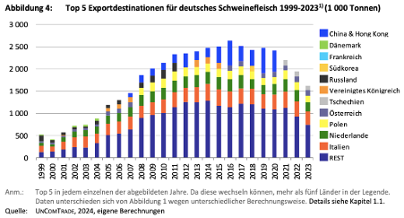

- Deutschland gehört zu den drei größten Exporteuren weltweit neben Spanien und den USA (Bundesinformationszentrum Landwirtschaft, 2022). Die USA und Spanien wechseln den ersten Platz (Deblitz et al., 2024).
- Die meisten Exporte von Schweinefleisch aus Deutschland gehen an EU-Länder. Die top fünf sind nur noch EU-Länder (Deblitz et al., 2024). Die meisten deutschen Exporte gehen nach Italien, gefolgt von den Niederlanden und Polen. 
- Der Export nach China, welcher einen lukrativen Preis hat, ist seit dem Ausbruch der afrikanischen Schweinepest zum Stillstand gekommen (Deblitz et al., 2024).

  

(Deblitz et al., 2024, S. 5)

 

---

  

## Referenzen
- Bundesinformationszentrum Landwirtschaft. (2022, November 4). *Nutztierhaltung: Schweinemast.* <https://www.nutztierhaltung.de/schwein/mast/>
- Deblitz, C., Zavyalova, K., & Efken, J. (2024, November 19). *Steckbriefe zur Tierhaltung in Deutschland: Ferkelerzeugung und Schweinemast.* Thünen-Institut für Betriebswirtschaft. <https://www.thuenen.de/media/ti-themenfelder/Nutztierhaltung_und_Aquakultur/Haltungsverfahren_in_Deutschland/Schweinehaltung/Steckbrief_Schweine_2024.pdf>
