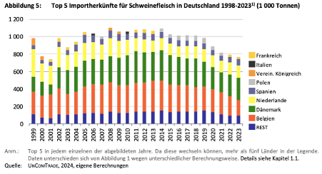

- Deutschland importiert unteranderem Ferkel und Schlachttiere (Deblitz, Zavyalova, et al., 2024). Die Ferkel stammen meist aus Dänemark und den Niederlanden, die Schlachttiere ebenfalls aus den beiden Ländern sowie Belgien (Deblitz, Zavyalova, et al., 2024).
- **Ferkelimporte:** Deutschland importiert viele Ferkel aus Dänemark, die Zahl ist 2024 um 17,5% im Vergleich zum Vorjahr gestiegen (circa 4,4 Millionen Ferkel) (Hungerkamp, 2024). In Dänemark herrschen andere Standortfaktoren als in Deutschland, sodass dieser Markt von Deutschland nach Dänemark weiter ausgegliedert wurde, da er aufgrund von verschärften Tierschutzregeln immer unprofitabler wird. Insgesamt steckt die deutsche Schweineproduktion in einer Krise, da die Nachfrage nach Schweinefleisch stetig sinkt (Hungerkamp, 2024; ISN-Interessengemeinschaft der Schweinehalter Deutschlands e. V., 2024).
- Schweinefleischexporte sind sehr hoch, besonders in den letzten 10 Jahren deutlich angestiegen, in den letzten Jahren jedoch etwas rückläufig (Deblitz, Zavyalova, et al., 2024).
- Die wichtigsten Import Länder für Schweinefleisch für Deutschland sind Dänemark, Belgien und die Niederlande (Deblitz, Zavyalova, et al., 2024).

  

(Deblitz, Zavyalova, et al., 2024, S. 6)

 

---

  

## Referenzen
- Deblitz, C., Zavyalova, K., & Efken, J. (2024, November 19). *Steckbriefe zur Tierhaltung in Deutschland: Ferkelerzeugung und Schweinemast.* Thünen-Institut für Betriebswirtschaft. <https://www.thuenen.de/media/ti-themenfelder/Nutztierhaltung_und_Aquakultur/Haltungsverfahren_in_Deutschland/Schweinehaltung/Steckbrief_Schweine_2024.pdf>
- Hungerkamp, M. (2024, September 20). *Steigende Ferkelimporte: Darum sollten Schweinehalter alarmiert sein* [Text]. agrarheute.com. <https://www.agrarheute.com/tier/schwein/steigende-ferkelimporte-sollten-schweinehalter-alarmiert-626266>
- ISN-Interessengemeinschaft der Schweinehalter Deutschlands e. V. (2024, Januar 26). *Schrumpfende Eigenerzeugung: Import ausländischer Schweine gewinnt 2023 wieder an Fahrt.* schweine.net. <https://www.schweine.net/news/schrumpfende-eigenerzeugung-import-auslaendischer.html#:~:text=Ferkel%20nach%20Deutschland%20importiert%2C%20was,2%20%252%205%20mehr%20als%20im%20Vorjahr>
