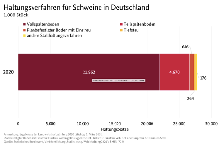

- Es gibt verschiedene Produktionsrichtungen bei Schweinehaltungsbetrieben: Zucht, der Jungsauenaufzucht, der Ferkelerzeugung, der Ferkelaufzucht und der Mast (Bundeszentrum für Ernährung, 2023). Die meisten Eber werden auf Besamungsstationen gehalten. Ist ein Eber für die Zucht geeignet, wird das in der Besamungsstation gewonnene Sperma verdünnt, konserviert und verkauft.
- Der Schwerpunkt der Schweinefleischerzeugung liegt in Deutschland auf der Schweinemast und ungefähr 37% der Mastschweine werden in Niedersachsen gehalten (Bundesinformationszentrum Landwirtschaft, 2022).
- Die durchschnittliche Mastdauer beträgt 112 Tage, weshalb es mehreren Zyklen in einem Jahr gibt (Deblitz et al., 2024).
- Mastschweine sind Schweine die mehr als 50kg wiegen (Deblitz et al., 2024), das Schlachtgewicht liegt meist bei ungefähr 120kg. 
- Ein Wurf umfasst durchschnittlich 12 Ferkel (Bundeszentrum für Ernährung, 2023).
- Typischer Produktionsablauf in der Schweinehaltung (Deblitz et al., 2024).

  

## Schweinezahlen

- Im November 2024 gab es in Deutschland 21,2 Millionen Schweine. Davon sind 9,7 Millionen Tiere Mastschweine, 6,3 Millionen Ferkel, 3,7 Millionen Jungschweine und 1,4 Millionen Zuchtschweine (Destatis, 2024).
- Im Mai 2024 gab es 20,9 Millionen Schweine in Deutschland. Bundesweit werden Schweine gehalten, davon die meisten (6,9 Millionen Tiere) in Niedersachsen (BMEL, o. J.-a). 
- Die Zahl der Schweine geht zurück, im Vergleich 2020 gab es etwa 3,9 Millionen Tiere mehr (BMEL, o. J.-a).  
- Der durchschnittliche Betrieb hält über 1.000 Schweine, Betriebe mit weniger Schweinen werden immer weniger. (BMEL, o. J.-a)

## Schweinebetriebe

- Es gab im November 2024 15,600 schweinehaltende Betriebe in Deutschland (Destatis, 2024).

## Haltungsformen

- Spaltenboden (Voll- und Teilspaltenboden)
- 27,8 Millionen Haltungsplätze waren in 2020 verfügbar (BMEL, o. J.-a). 
- Nur 1% der Haltungsplätze für Schweine ist mit einem Auslauf versehen (Deblitz et al., 2024).

  

(BMEL, o. J.-a)

 

---

  

## Referenzen
- BMEL. (o. J.-a). Schweinehaltung. BMEL-Statistik. Abgerufen 2. Januar 2025, von https://www.bmel-statistik.de/landwirtschaft/tierhaltung/schweinehaltung
- Bundesinformationszentrum Landwirtschaft. (2022, November 4). Nutztierhaltung: Schweinemast. https://www.nutztierhaltung.de/schwein/mast/
- Bundeszentrum für Ernährung. (2023, Juni 10). Schweinefleisch: Erzeugung. https://www.bzfe.de/lebensmittel/vom-acker-bis-zum-teller/schweinefleisch/schweinefleisch-erzeugung/
- Deblitz, C., Zavyalova, K., & Efken, J. (2024, November 19). Steckbriefe zur Tierhaltung in Deutschland: Ferkelerzeugung und Schweinemast. Thünen-Institut für Betriebswirtschaft. https://www.thuenen.de/media/tithemenfelder/Nutztierhaltung_und_Aquakultur/Haltungsverfahren_in_Deutschland/Schweinehaltung/Steckbrief_Schweine_2024.pdf
- Destatis. (2024, Dezember). Schweinebestand 2024 im Vergleich zum Vorjahr nahezu konstant. Statistisches Bundesamt. https://www.destatis.de/DE/Themen/Branchen-Unternehmen/Landwirtschaft-Forstwirtschaft-Fischerei/Tiere-Tierische-Erzeugung/schweine.html

