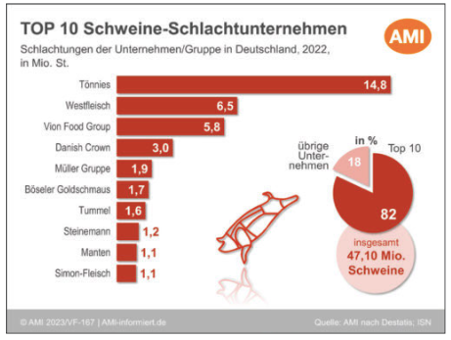

- Die Schlachtunternehmen können in zwei Gruppen unterteilt werden. Zum einen die Schlachthöfe, die die Tiere nur schlachten und kühlen für den Verkauf an Großhändler, zum anderen die Schlachthöfe, welche zusätzlich die Tiere in den eigenen Anlagen zerlegen und als Fleischabschnitte mit und ohne Knochen weiterverkaufen (entweder an die weiterverarbeitende Industrie oder Groß- und Einzelhändler) (BLE, 2024).
- Fleischmenge des menschlichen Verzehrs ist anders als das Schlachtgewicht. Zum Beispiel werden Fett und Speck, die nicht vom Menschen verzehrt werden in der Industrie weiterverwendet (Deblitz et al., 2024).
- Rund ein Drittel der Schweine wird in Niedersachsen geschlachtet (BLE, 2024). 
- "Die Schlachtbranche von Schweinen wird von den 10 größten Schlachtunternehmen geprägt. So konnten 2022 die Top 10 der deutschen Schweineschlachtbetriebe einen Marktanteil von 82 % erlangen. Die drei größten Unternehmen (Tönnies 14,79 Mio. Schlachtungen, Westfleisch 6,51 Mio. Schlachtungen und Vion 5,8 Mio. Schlachtungen) allein erreichten einen Marktanteil von 57,5 %." (BLE, 2024, S. 5). 
- Das folgende Bild zeigt die Top 10 Schweine-Schlachtunternehmen in 2022 (*Situationsbericht 2023/24 Trends und Fakten zur Landwirtschaft*, 2023, S. 30):

  

 

---

  

## Referenzen
- BLE. (2024). *Bericht zur Markt- und Versorgungslage Fleisch 2024.* <https://www.bmel-statistik.de/fileadmin/daten/0611090-2024.pdf>
- Deblitz, C., Zavyalova, K., & Efken, J. (2024, November 19). *Steckbriefe zur Tierhaltung in Deutschland: Ferkelerzeugung und Schweinemast.* Thünen-Institut für Betriebswirtschaft. <https://www.thuenen.de/media/ti-themenfelder/Nutztierhaltung_und_Aquakultur/Haltungsverfahren_in_Deutschland/Schweinehaltung/Steckbrief_Schweine_2024.pdf>
- *Situationsbericht 2023/24 Trends und Fakten zur Landwirtschaft* (1. Auflage) (with Pascher, D. P., & Rukwied, J.). (2023). Deutscher Bauernverband e.V.
