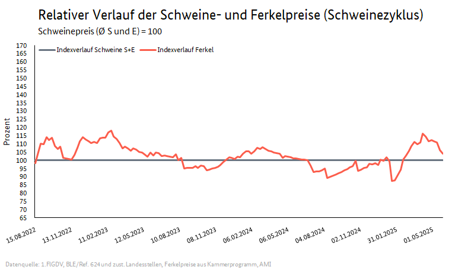

## Nachhaltigkeit

- Gülle in Biogasanlagen (Bodensee-Stiftung et al., 2024)
- Kot-Harn Trennung, um die Entstehung von Ammoniak zu verhindern - getrennte Aufbewahrung der Exkremente (Bodensee-Stiftung et al., 2024)

## Schweinezyklus

- "Der Schweinezyklus bezeichnet eine periodische Schwankung der Angebotsmenge und des Marktpreises. Das Problem tritt auf Märkten auf, an denen die Angebotsmenge nicht kurzfristig an die aktuelle Nachfrage angepasst werden kann. Betroffen sind Produktionsgüter, die eine längere Vorlaufzeit benötigen und bei der die Anpassungsreaktion zeitverzögert stattfindet. Problematisch ist, dass der Anbieter sich nicht an die aktuelle Nachfrage ausrichten kann, sondern sich an die Erwartungen für die Zukunft orientieren muss. Wird das Angebot zu stark ausgeweitet, kommt es zum starken Preisrückgang. Das Angebot wird reduziert, wodurch zeitverzögert eine erhöhte Nachfrage und ein hoher Marktpreis entsteht. Erstmalig beschrieben wurde dieses Phänomen 1928 vom Agrarökonom Arthur Hanau in der Dissertation "Die Prognose der Schweinepreise"." (BMEL, o. J.-b). Zusammengefasst beschreibt der Schweinezyklus die nachfrageseitig induzierte Überproduktion an Schweinefleisch.

  

(BMEL, o. J.-b)

## Mastarten

Es gibt vier verschiedene Mastarten, welche unterschiedliche Verwendungszwecke der Hühner haben:

1. **Kurzmast**: Die Kurzmast dauert 28 bis 30 Tage und die Tiere erreichen ein Schlachtgewicht von 1,5 bis 1,6kg. Dies bedeutet, dass am Ende 22-23 Tiere eine Quadratmeter Stall teilen und somit bis zu acht Durchgänge pro Jahr gemacht werden können. Diese Tiere werden meist als "ganzes Tier" im Handel verkauft.
2. **Mittellangmast**: Die Mittellangmast dauert 32 bis 35 Tage und das Schlachtgewicht liegt zwischen 2 und 2,5kg. Hier teilen sich 18-19.5 Tiere eine Quadratmeter Stallboden und es werden bis zu 7 Durchgänge im Jahr durchgeführt. Diese Hühner werden zur Verarbeitung als Teilstücke genutzt.
3. **Langmast/Schwermast**: Diese Mastart dauert 38 bis 42 Tage und das Schlachtgewicht liegt bei 2,5 bis 2,7kg. Diese Mastart ist besonders beliebt zur Gewinnung von Hühnchenbrust. Da die Tiere relativ groß werden teilen sich hier "nur" 14,5-16 Tiere einen Quadratmeter. Auch hier werden ungefähr 7 Durchgänge im Jahr durchgeführt.
4. **Splittingverfahren**: Das Splittingverfahren bedeutet, dass Tiere am 29. Tag und am 33. Tag rausgenommen und geschlachtet werden, wobei die restlichen Tiere weiter gemästet werden. Es ist sozusagen eine Kombination der anderen Mastarten.

Die Mittellangmast und die Langmast sind die am beliebtesten Mastarten. 

 

---

  

## Referenzen
- BMEL. (o. J.-b). *Schweinezyklus.* BMEL-Statistik. Abgerufen 12. Juni 2025, von <https://www.bmel-statistik.de/preise/preise-fleisch/schweinezyklus>
- Bodensee-Stiftung, Landesanstalt für Schweinezucht Boxberg, Hochschule für Wirtschaft und Umwelt (HfWU) Nürtingen-Geislingen, & Verband der Agrargewerblichen Wirtschaft e. V. (2024). *Mehr Nachhaltigkeit in der Wertschöpfungskette Schweinefleisch durch stabile regionale Lieferketten* (Wert Schwein). <https://www.bodensee-stiftung.org/wp-content/uploads/EIP-WertSchwein_Massnahmenkatalog_Internet.pdf>
- Thobe, P., Chibanda, C., & Koch, S. (o. J.). *Steckbriefe zur Tierhaltung in Deutschland: Mastgeflügel.*
