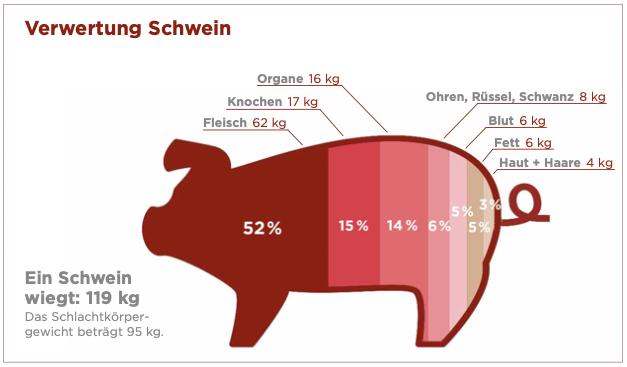

- "Das eigentliche Fleisch macht nur gut die Hälfte des Schlachtgewichts aus." Die weiteren Teile werden anderweitig genutzt, so dass fast nichts übrigbleibt (Fokus Fleisch Report zur deutschen Fleischwirtschaft, 2023, S. 61):

  

 

---

  

## Referenzen
- *Fokus Fleisch Report zur deutschen Fleischwirtschaft.* (2023). Fokus Fleisch. <https://www.fokus-fleisch.de/assets/uploads/downloads/fokus-fleisch-report-fleischwirtschaft_2023-05-24-131337.pdf>
