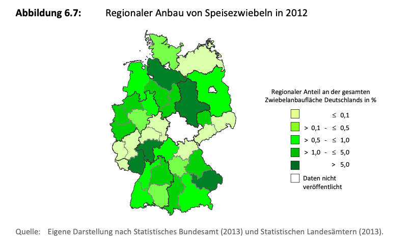

- Zwiebeln werden auch in Fruchtfolgen angebaut, typischerweise sollten vier bis fünf Jahre dazwischen liegen. Dies ist einer der Gründe, weshalb die Anbaufläche und Erträge schwanken können über mehrere Jahre (Strohm et al., 2016). 
- In Deutschland werden Zwiebeln überwiegend aus **Saatgut** (schwarze Samen) angebaut, welche im konventionellen Anbau mit Pflanzenschutzmittel gebeizt sind, um dem Keimling einen Anfangsschutz zu geben. Neben der Aussaat von Saatgut, gibt es auch die Möglichkeit **Steckzwiebeln** zu nutzen. Diese sind ein bis zwei Zentimeter groß und verkürzen die Anbauzeit um einige Wochen. Eine dritte Möglichkeit stellen Zwiebel-**Jungpflanzen** dar, welche oft im ökologischen Anbau genutzt werden, denn dort ist es besonders schwer die Samen/Steckzwiebeln vor Beikräutern zu schützen (Bundesinformationszentrum Landwirtschaft, 2024; Fachverband Deutsche Speisezwiebel e.V., o. J.; Koller et al., 2007).
- Die Aussaat der *Sommerzwiebeln* beginnt, sobald der Boden trocken genug ist. Dies kann bereits im Februar geschehen. Steckzwiebeln werden im März angebaut und Jungpflanzen bis spätestens Ende April (Bundesinformationszentrum Landwirtschaft, 2024). Sommerzwiebeln sind viel häufiger als Winterzwiebeln (9 von 10 sind Sommerzwiebeln) (Land schafft Leben, o. J.).
- In wärmeren Anbaugebieten, vor allem im Süden Deutschlands gibt es neben den Sommerzwiebeln auch *Winterzwiebeln*, welche im August des Vorjahres ausgesät werden und auf dem Feld überwintern, bevor sie im Juni geerntet werden (Bundesinformationszentrum Landwirtschaft, 2024).
- Zwiebeln benötigen eine gleichmäßige Wasserversorgung, weshalb sie häufig bis zur Ernte beregnet werden müssen (Bundesinformationszentrum Landwirtschaft, 2024; Koller et al., 2007). 
- Um genügend Licht für die Zwiebelpflanze zu haben, müssen Beikräuter und Unkraut bekämpft werden. Häufig werden Pestizide eingesetzt (Bundesinformationszentrum Landwirtschaft, 2024). Vor allem bei Zwiebeln nimmt die Unkrautregulierung besonders viel Zeit in Anspruch, da teilweise mit Hand gehackt werden muss. So können im ökologischen Anbau bis zu 200 Stunden pro Hektar erwartet werden (*Ökologischer Zwiebelanbau*, 2022).

## Anbaufläche und -regionen

- Niedersachsen ist eins der Hauptanbaugebiete für Speisezwiebeln mit einer Fläche von 4.892,3 Hektar (2023) (Landwirtschaftskammer Niedersachsen, o. J.). Weitere erwähnenswerte Bundesländer im Zwiebelanbau sind Bayern, Rheinland-Pfalz, Hessen und Sachsen-Anhalt (Strohm et al., 2016). 
- Besonders der Landkreis Uelzen ist ein Schwerpunkt für den Zwiebelanbau, Hannover und Braunschweig sind ebenfalls nennenswert (Landwirtschaftskammer Niedersachsen, o. J.; Strohm et al., 2016). 
- Die nachfolgende Abbildung zeigt den Anbau von Speisezwiebeln in Deutschland (Strohm et al., 2016, S. 65):

  

- 2023 wurden Speisezwiebeln auf 15.100 Hektar angebaut und ist somit das am zweithäufigsten angebaute Gemüse nach Fläche in Deutschland (BMEL, 2024). Im Vergleich zum Vorjahr hat die Anbaufläche von Speisezwiebeln um 17% zugenommen (BLE, o. J.-a).
- Auch beim Zwiebelanbau überwiegt der konventionelle Anbau. 1.542 Hektar wurden ökologisch bewirtschaftet für Speisezwiebeln (Bundesinformationszentrum Landwirtschaft, 2024).
- 2023 bauten 1.756 Betriebe Speisezwiebeln an (Bundesinformationszentrum Landwirtschaft, 2024).
- Zwiebeln mögen warme und sonnige Anbauflächen, windoffene Lagen sind von Vorteil, da Feuchtigkeit schneller abtrocknen kann und die Wahrscheinlichkeit von Pilzbefall geringer ist (Bundesinformationszentrum Landwirtschaft, 2024).

## Zwiebelernte

- 2023 wurden 666.300 Tonnen Speisezwiebeln geerntet, damit sind Speisezwiebeln auf dem zweiten Rang nach Möhren von der Gemüseernte (BMEL, 2024). Der Hektarertrag lag bei 44 Tonnen (Bundesinformationszentrum Landwirtschaft, 2024).
- Niedersachsen erntete 2023 215.932 Tonnen Speisezwiebeln, deutschlandweit die meisten (Landesamt für Statistik Niedersachsen, 2024).
- Zwiebeln werden im von Juni bis September geerntet, je nach Art der Aussaat und Anbau:
      - Juni: Winterzwiebeln,
      - Juli: Gesteckte Sommerzwiebeln,
      - August/September: Ausgesäte und gepflanzte Sommerzwiebeln (Bundesinformationszentrum Landwirtschaft, 2024).
- Der richtige Erntezeitpunkt kann daran erkannt werden, dass die Schlotten (Zwiebellaub) anfangen umzuknicken und zu trocknen. Wenn sie etwa halb umgeknickt sind, wird der Zwiebelkrautschläger eingesetzte und schlägt das Laub circa 8-10 Zentimeter über dem Zwiebelansatz ab (Bundesinformationszentrum Landwirtschaft, 2024).
- Anschließend hebt der Roder die Zwiebeln aus der Erde und legt sie locker in Reihen auf dem Feld ab, sodass die Zwiebeln bereits einige Tage lang trocknen können. Falls die Witterung dies nicht zulässt, werden die Zwiebeln samt Erde mit einem Vollernter aufgenommen und ins Lager gebracht (Bundesinformationszentrum Landwirtschaft, 2024).

## Selbstversorgungsgrad
Der SVG von Speisezwiebeln lag 2022/2023 bei 68,2% (BLE, o. J.-b).

## Schalotten Anbau
- "Bei Schalotten gibt es zwei Produktionsverfahren: Werden sie ausgesät, bildet sich eine Zwiebel pro Saatkorn. Werden Schalotten wie in der Bretagne traditionell gesteckt, bilden sich mehrere Tochterzwiebeln, die sich bei und nach der Ernte voneinander trennen. In der Wurzelregion kann man den Abbruchpunkt erkennen." (Bundesinformationszentrum Landwirtschaft, 2021).
- Schalotten werden meist von Hand geerntet (Bundesinformationszentrum Landwirtschaft, 2021).

## Zwiebelzüchtung
Die wichtigsten Aspekte der Zwiebelzüchtung sind die äußere Beschaffenheit, die Schale, die Festigkeit und die Lagerfähigkeit (Land schafft Leben, o. J.).

 

---

  

## Referenzen

- BLE. (o. J.-a). *Gartenanbau: Gemüseanbau.* BMEL-Statistik. Abgerufen 5. März 2025, von <https://www.bmel-statistik.de/landwirtschaft/gartenbau/gemueseanbau>
- BLE. (o. J.-b). *Versorgungsbilanzen: Obst, Gemüse, Zitrusfrüchte, Schalen- und Trockenobst.* BMEL-Statistik. Abgerufen 21. Februar 2025, von <https://www.bmel-statistik.de/ernaehrung/versorgungsbilanzen/obst-gemuese-zitrusfruechte-schalen-und-trockenobst>
- BMEL. (2024). *Erntebericht 2024: Mengen und Preise.* <https://www.bmel.de/SharedDocs/Downloads/DE/Broschueren/erntebericht-2024.pdf?__blob=publicationFile&v=5>
- Bundesinformationszentrum Landwirtschaft. (2021, Juni 21). *Zwiebeln und Schalotten.* Bundesanstalt für Landwirtschaft und Ernährung. <https://www.ble.de/SharedDocs/Downloads/DE/Ernaehrung-Lebensmittel/Vermarktungsnormen/VermarktungsnormenObstGemuese/Flyer/Zwiebeln.pdf?__blob=publicationFile&v=1>
- Bundesinformationszentrum Landwirtschaft. (2024, November 6). *Zwiebeln.* Bundesinformationszentrum Landwirtschaft. <https://www.landwirtschaft.de/einkauf/lebensmittel/pflanzliche-lebensmittel/zwiebeln>
- Fachverband Deutsche Speisezwiebel e.V. (o. J.). *Die Zwiebel: Übersicht.* deutsche-zwiebel.de. Abgerufen 5. März 2025, von <https://www.deutsche-zwiebel.de/die-zwiebel/uebersicht/>
- Koller, M., Lichtenhahn, M., & Six, R. (2007). *Merkblatt: Biologischer Anbau von Zwiebeln.* Bio Austria. <https://www.bioland.de/fileadmin/user_upload/Erzeuger/Fachinfos/Merkblaetter/MB_Zwiebeln.pdf>
- Land schafft Leben. (o. J.). *Zwiebel: Herstellung.* Abgerufen 5. März 2025, von <https://www.landschafftleben.at/lebensmittel/zwiebel/herstellung/die-pflanze-und-ihre-bauern>
- Landesamt für Statistik Niedersachsen. (2024, März 12). *Speisezwiebeln—Meistgeerntetes Gemüse in Niedersachsen.* <https://www.statistik.niedersachsen.de/presse/speisezwiebeln-meistgeerntetes-gemuese-in-niedersachsen-230328.html>
- Landwirtschaftskammer Niedersachsen. (o. J.). *Der Gemüsebau in Niedersachsen.* Abgerufen 5. März 2025, von <https://www.lwk-niedersachsen.de/lwk/news/33787_Der_Gemuesebau_in_Niedersachsen>
- *Ökologischer Zwiebelanbau.* (2022, März 4). oekolandbau.de. <https://www.oekolandbau.de/bio-in-der-praxis/oekologische-landwirtschaft/oekologischer-pflanzenbau/bio-anbausteckbriefe/feldgemuesebau/zwiebeln/>
- Strohm, K., Garming, H., & Dirksmeyer, W. (2016). *Entwicklung des Gemüsebaus in Deutschland von 2000 bis 2015: Anbauregionen, Betriebsstrukturen, Gemüsearten und Handel* (Thünen Working Paper 56). Thünen-Institut für Betriebswirtschaft. <https://www.thuenen.de/media/publikationen/thuenen-workingpaper/ThuenenWorkingPaper_56.pdf>
