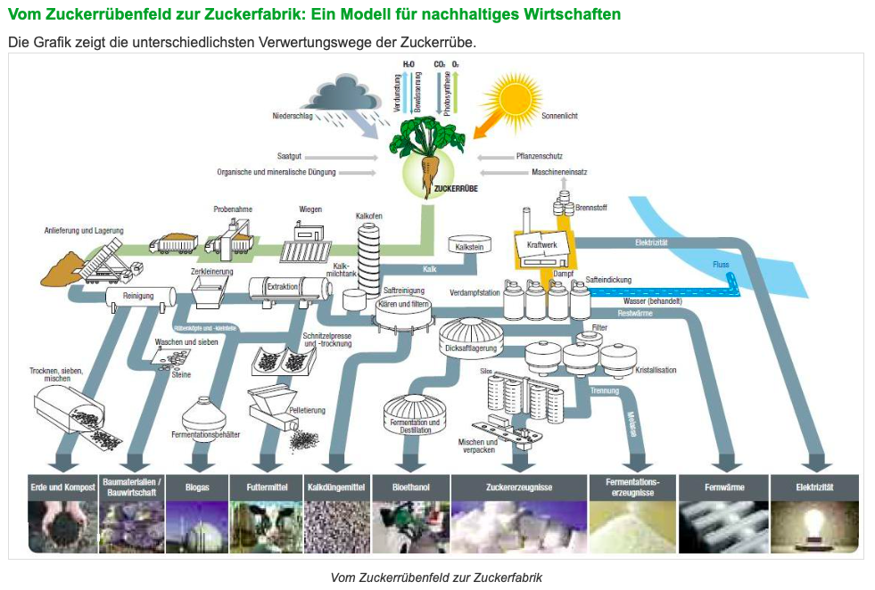
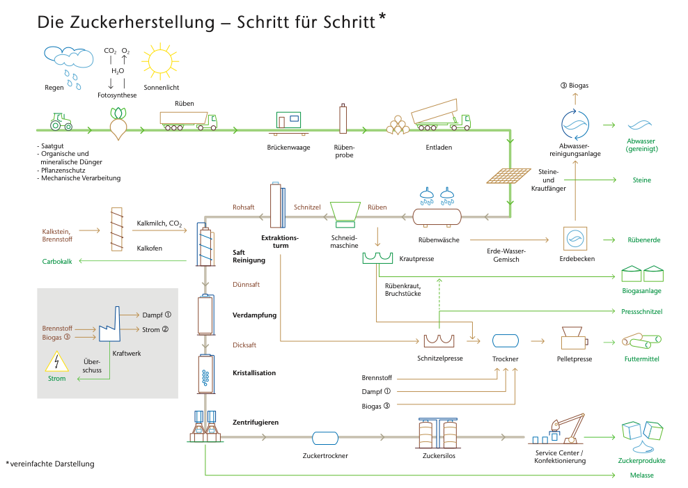
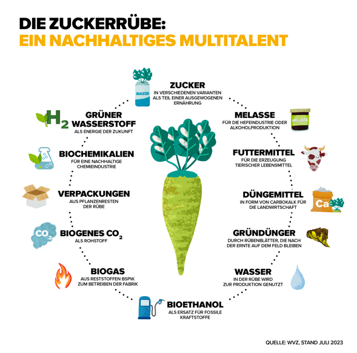
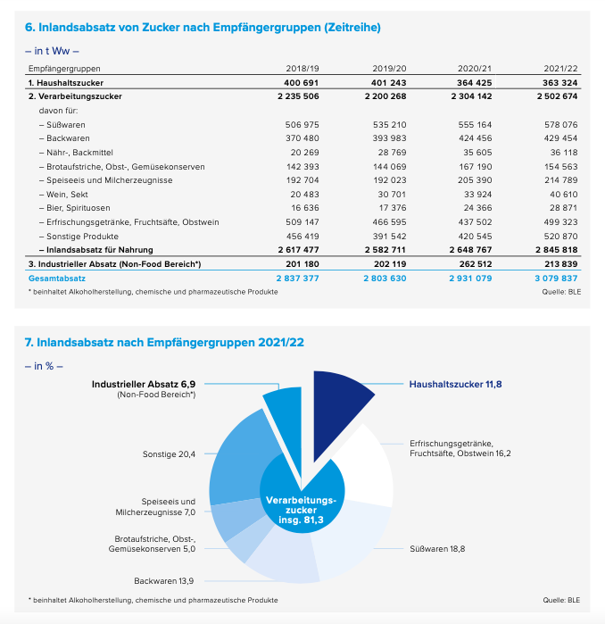
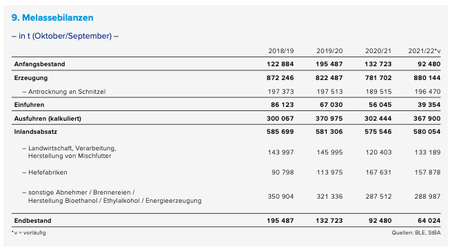

## Zuckerherstellung
- 2023 wurden 4,3 Millionen Tonnen Zucker hergestellt (BLE, 2024b).
- Für die Herstellung von einem Kilogramm reinem Zucker braucht man etwa sieben Zuckerrüben (Anbaufläche entspricht 0,8 Quadratmetern) (Bundesinformationszentrum Landwirtschaft, 2024b).
- Für die Zuckerherstellung wurden 30,2 Millionen Tonnen der insgesamt 31,6 Millionen Tonnen geernteten Zuckerrüben verwendet (BLE, 2024b). 
- 100% eigen angebaute Zuckerrüben werden in Deutschland verarbeitet (BLE, 2024b).
- Die Zuckerrübe wird zu 100% verwertet, nichts bleibt übrig. Die Zuckerrübe ist eine Kreislaufwirtschaft (Kuratorium für Versuchswesen und Beratung im Zuckerrübenanbau, o. J.; Wirtschaftliche Vereinigung Zucker e.V. & Verein der Zuckerindustrie e.V., o. J.-d).
- Zucker ist ein 100%iges Naturprodukt (Dachverband Norddeutscher Zuckerrübenanbauer e.V., o. J.-f).
- Während der Zuckerkampagne ist es wichtig, dass eine durchgängige Versorgung mit Zuckerrüben stattfindet. Die Zuckerindustrie verlässt sich da auf das "Just-in-Time" Prinzip bei der Zuckerherstellung. Der produzierte Zucker wird überwiegend bei den Fabriken gelagert, welche das ganze Jahr über Transporte zu weiterverarbeitenden Industrien und den Handel durchführen (BLE, 2024b).

## Wertschöpfungskette Zuckerherstellung
Von der Zuckerrübe zum Zucker (Bundesinformationszentrum Landwirtschaft, 2024b):
1. Waschen der Zuckerrüben
2. Schneiden in Rübenschnitzel
3. Zucker Extraktion durch heißes Wasser -> Zuckersaft (13-15% Zucker)
4. Reinigung des Zuckersafts (Entfernung von Nichtzuckerstoffen)
5. Verdampfungskristallisation lässt einen zähflüssigen Sirup entstehen
6. Trennung von Zucker und Sirup in Kristallisatoren
7. Spülung des Zuckers mit heißem Wasser in einer Zentrifuge und anschließende Trocknung.

Von der Zuckerrübe vom Feld bis zum Zucker werden viele verschiedene Schritte durchlaufen. Die Zuckerrübenwertschöpfungskette ist ein Beispiel für nachhaltiges Wirtschaften, denn sie ist eine "closed-loop" Kette. Nebenprodukte werden weiterverwendet und es gibt kaum Abfälle. Die folgenden Grafiken zeigen eine Übersicht:

  

(Dachverband Norddeutscher Zuckerrübenanbauer e.V., o. J.-f)

  

(Nordzucker, 2022)

## Zuckersorten
- Es gibt viele verschiedene Zuckersorten. Zum einen kann in Trauben-, Frucht-, und Milchzucker unterschieden werden. Zum anderen in Puderzucker, Hagelzucker, Würfelzucker, und Kandiszucker (Maschkowski & Lobitz, 2022). 
- Zusätzlich gibt es auch Zuckersorten mit bestimmten Zusatzstoffen: Gelierzucker, Einmachzucker, Vanillezucker, und Vanillinzucker (Maschkowski & Lobitz, 2022). 
- Zucker muss nicht immer weiß sein, es gibt auch braune Sorten, häufig wird jedoch von Weißzucker gesprochen (Maschkowski & Lobitz, 2022). 

## Zuckerverwendung
- Zuckerrüben sind vielseitig einsetzbar. Sie liefern Zucker, sind Ausgangsprodukte für Tierfutter, biobasierte Kunststoffe und Kraftstoffe und Dünger, und beinhalten Grundstoffe für die Alkohol-, Chemie-, Hefe-, und Pharmaindustrie (Wirtschaftliche Vereinigung Zucker e.V. & Verein der Zuckerindustrie e.V., o. J.-c). Wie oben bereits erwähnt ist die Zuckerrübe ein Beispiel für nachhaltiges Wirtschaften, denn 100% der Rübe werden verwendet (Wirtschaftliche Vereinigung Zucker e.V. & Verein der Zuckerindustrie e.V., o. J.-d, 2023b):

  

- Dabei wird Zucker wie folgt verwendet (BLE, o. J.-c; Wirtschaftliche Vereinigung Zucker e.V. & Verein der Zuckerindustrie e.V., o. J.-e; 2023a):
1. 93% in den Nahrungsverbrauch (2,5 Millionen Tonnen),
   - davon 81% in der Verarbeitungsindustrie und 18,8% Süßwaren
       - 16,2% Erfrischungsgetränke, Fruchtsäfte, Obstwein
       - 13,9% Backwaren
       - 7% Speiseeis und Milcherzeugnisse
       - 5% Brotaufstriche, Obst- und Gemüsekonserven
       - 20,4% Sonstiges
  - 12% als Haushaltszucker (typischerweise Vermarktung in 1kg Paketen als Weißzucker (Bundesinformationszentrum Landwirtschaft, 2024b))
2. 7% in die industrielle Verwendung (174.300 Tonnen) (BLE, o. J.-c).

  

(Wirtschaftliche Vereinigung Zucker e.V. & Verein der Zuckerindustrie e.V., 2023a, S. 86)

- Futterzucker wird an Imker als Winterfutter für Bienen verkauft (BLE, 2024b). 
- Zuckersirup wird während der Zuckerkampagne hergestellt und in den Fabriken gelagert. Während des gesamten Jahres werden dann Erzeugnisse aus Zuckersirup je nach Bedarf hergestellt. 

## Nebenprodukte
# Melasse
- Melasse ist ein dickflüssiger, brauner Sirup, welcher noch über 50% Zucker enthält, welcher nicht mehr auskristallisiert werden kann (Dachverband Norddeutscher Zuckerrübenanbauer e.V., o. J.-f).
- Melasse wird zur Antrocknung von Rübenschnitzeln genutzt, sowie zur Hefeproduktion, als Bestandteil von Mischfutter in der Landwirtschaft, bei der Alkoholherstellung und Bioethanol Herstellung (BLE, 2024b; Wirtschaftliche Vereinigung Zucker e.V. & Verein der Zuckerindustrie e.V., 2023a, S. 87):

  

- Melasse wird ebenfalls in der Pharmazie verwendet, insbesondere als Trägerstoffe in Medikamenten und als Nahrungsergänzungsmittel (Wirtschaftliche Vereinigung Zucker e.V. & Verein der Zuckerindustrie e.V., 2023b).

# Rübenschnitzel
- Nass-, Trocken- oder Pressschnitzel für viehhaltende Landwirtschaftsbetriebe oder als marktgängige Futtermittel für Wiederkäuer, insbesondere Rinder und Schafe, sowie Schweine und Pferde (BLE, 2024b; Bundesinformationszentrum Landwirtschaft, 2024b). Es gibt Rübenschnitzel mit und ohne Melasse (Wirtschaftliche Vereinigung Zucker e.V. & Verein der Zuckerindustrie e.V., 2023a, S. 87).
- Die verschiedenen Arten der Rübenschnitzel unterscheiden sich nur minimal. Dies wird durch den Verarbeitungsgrad deutlich (Bundesinformationszentrum Landwirtschaft, 2024b).

# Carbokalk
- Bei der Reinigung des Zuckerrohsaftes mit Kalkmilch und Kohlensäure entsteht ein Kalkgemisch: Carbokalk. Dieses ist ein sehr beliebtes Kalk-Düngemittel in der Landwirtschaft (Bundesinformationszentrum Landwirtschaft, 2024b; *Nutzung der gesamten Rübe*, o. J.).
- Kalkmilch bindet die Nichtzuckerstoffe, die bei der Trennung von Zucker und Nichtzuckerstoffen vorhanden sind (*Nutzung der gesamten Rübe*, o. J.).

# Rübenblätter
- Rübenblätter werden als Grundstoff für Fleischersatzprodukte weiterverwendet oder als natürlicher Gründünger auf dem Feld (Wirtschaftliche Vereinigung Zucker e.V. & Verein der Zuckerindustrie e.V., 2023b).

# Biogenes CO2
- Bei der Herstellung von Zucker wird biogenes CO2 freigesetzt, welches als Kohlensäure für die Getränkeindustrie genutzt wird (Wirtschaftliche Vereinigung Zucker e.V. & Verein der Zuckerindustrie e.V., 2023b).

## Akteurs Infos Zuckerfabriken
Es gibt in Deutschland zurzeit 18 Zuckerfabriken, die von vier Unternehmen betrieben werden. Fabriken und Mitarbeiterzahlen waren in den letzten Jahren rückläufig (BLE, 2024b):
- Nordzucker: <https://www.nordzucker.com/de/>
- Consun Beet Company: <https://www.cosunbeetcompany.de>
- Südzucker: <https://www.suedzuckergroup.com/de>
- Pfeifer & Langen: <https://www.pfeifer-langen.com>

 

---

  

## Referenzen
- BLE. (o. J.-c). *Versorgungsbilanzen: Zucker, Glukose.* BMEL-Statistik. Abgerufen 25. Februar 2025, von <https://www.bmel-statistik.de/ernaehrung/versorgungsbilanzen/zucker-glukose>
- BLE. (2024b). *Bericht zur Markt- und Versorgungslage Zucker—2024.* Bundesanstalt für Landwirtschaft und Ernährung. <https://www.bmel-statistik.de/fileadmin/daten/0611050-2024.pdf>
- Bundesinformationszentrum Landwirtschaft. (2024b, Oktober 11). *Zucker.* Landwirtschaft.de. <https://www.landwirtschaft.de/einkauf/lebensmittel/pflanzliche-lebensmittel/zucker>
- Dachverband Norddeutscher Zuckerrübenanbauer e.V. (o. J.-f). *Verwertungsmöglichkeiten der Zuckerrübe.* dnz.de. Abgerufen 10. März 2025, von <https://www.dnz.de/rund-um-ruebe-zucker/verwertungsmoeglichkeiten/>
- Kuratorium für Versuchswesen und Beratung im Zuckerrübenanbau. (o. J.). *Zuckerrübenanbau natürlich nachhaltig durch...* Abgerufen 10. März 2025, von <https://bisz.suedzucker.de/wp-content/uploads/2016/05/Poster6_Nutzung_ges_Ruebe.pdf>
- Maschkowski, G., & Lobitz, R. (2022, November 1). *Zucker: Beliebtes Süßungsmittel in vielen Varianten.* Bundeszentrum für Ernährung. <https://www.bzfe.de/lebensmittel/lebensmittelkunde/zucker/>
- Nordzucker. (2022, Januar). *Von der Rübe zum Zucker.* <https://www.nordzucker.com/de/wp-content/uploads/sites/2/2020/08/NZ_Zuckerflyer_D_2022_online.pdf>
- *Nutzung der gesamten Rübe.* (o. J.). Beratung und Information für den süddeutschen Zuckerrübenanbau. Abgerufen 10. März 2025, von <https://bisz.suedzucker.de/anbau/nachhaltigkeit/nutzung-der-gesamten-ruebe/#>
- Wirtschaftliche Vereinigung Zucker e.V. & Verein der Zuckerindustrie e.V. (o. J.-c). *Rübenanbau.* Zuckerverbände. Abgerufen 10. März 2025, von <https://www.zuckerverbaende.de/anbau-und-verarbeitung/ruebenanbau/>
- Wirtschaftliche Vereinigung Zucker e.V. & Verein der Zuckerindustrie e.V. (o. J.-d). *Verarbeitung.* Zuckerverbände. Abgerufen 12. März 2025, von <http://www.zuckerverbaende.de/anbau-und-verarbeitung/nachhaltigkeit-und-innovation/verarbeitung/>
- Wirtschaftliche Vereinigung Zucker e.V. & Verein der Zuckerindustrie e.V. (2023a). *Jahresbericht 2022/2023.* <https://www.zuckerverbaende.de/wp-content/uploads/2023/05/WVZ_VdZ_Jahresbericht_2022-2023.pdf>
- Wirtschaftliche Vereinigung Zucker e.V. & Verein der Zuckerindustrie e.V. (2023b, Juli). *Rohstoffverwertung.* Zuckerverbände. <http://www.zuckerverbaende.de/anbau-und-verarbeitung/verarbeitung/rohstoffverwertung/>
