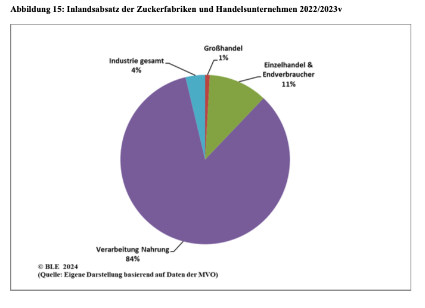

- 84% des im Inland zu Nahrungszwecken abgesetzten Zucker wird in der Verarbeitungsindustrie genutzt,
- 11% gehen direkt in den Einzelhandel,
- 1% an den Großhandel,
- 4% Industrie (BLE, 2024b).

  

(BLE, 2024b, S. 19).

 

---

  

## Referenzen
- BLE. (2024b). *Bericht zur Markt- und Versorgungslage Zucker — 2024.* Bundesanstalt für Landwirtschaft und Ernährung. <https://www.bmel-statistik.de/fileadmin/daten/0611050-2024.pdf>
