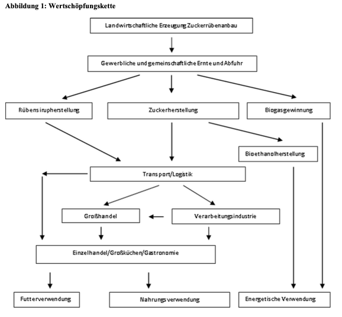

## Zuckerproduktion
- Weltweit wird Zucker produziert, der Großteil (79%) wird aus Zuckerrohr hergestellt und 21% werden aus Zuckerrüben hergestellt. Die EU ist der größte Hersteller von Zuckerrübenzucker und deckt rund 50% des Zuckerrübenzucker Gesamterzeugung (BLE, 2024b). In der EU wird kein Zuckerrohr angebaut und die Hauptanbauländer von Zuckerrüben sind Frankreich, Deutschland und Polen (Bundesinformationszentrum Landwirtschaft, 2024b).
- Im weiteren Verlauf wird die Zuckerherstellung aus Zuckerrüben vertiefend analysiert, denn Zuckerrohr wird in Europa nicht für die Zuckerherstellung angebaut. Zuckerrüben sind ein wirtschaftlich wichtiger Aspekt für Deutschland und werden im Freiland angebaut (mehr Infos über den Anbau sind auf der Seite "Zuckerrübenanbau" zu finden).

## Zuckerrüben
- Zuckerrüben gehören zu den Hackfrüchten, genau wie Kartoffeln. "Hackfrüchte sind Kulturpflanzen, bei deren Anbau traditionell durch wiederholtes Hacken des Bodens Beikräuter entfernt werden." (BLE, o. J.-b).
- In Deutschland sind rund 30 Zuckerrübensorten für den Anbau zugelassen. Sie unterschieden sich im Zuckerertrag und der Resistenz gegenüber Krankheiten und Schädlingen (Dachverband Norddeutscher Zuckerrübenanbauer e.V., o. J.-b).
- Die Zuckerrübe gehört zu der Familie der Gänsefußgewächse und bildet bis zu zwei Meter tiefe Wurzeln (Wirtschaftliche Vereinigung Zucker e.V. & Verein der Zuckerindustrie e.V., o. J.-a).
- Zuckerrüben sind zweijährige Pflanzen, ebenso wie Möhren. Im ersten Jahr bilden sie Rübenkörper und Rübenblatt und werden bis zu einem halben Meter groß. Im zweiten Jahr blüht die Zuckerrübe und entwickelt Samen. In Deutschland werden Zuckerrüben nur im ersten Jahr angebaut, denn dann werden sie zu Zucker, Futtermitteln, Bioethanol und Biogas verarbeitet. Im zweiten Jahr für die Saatgutproduktion (Dachverband Norddeutscher Zuckerrübenanbauer e.V., o. J.-d; Wirtschaftliche Vereinigung Zucker e.V. & Verein der Zuckerindustrie e.V., o. J.-a).

## Zuckerkampagne
- Zuckerrüben werden in Kampagnen angebaut und verarbeitet. Kampagne bezeichnet den Verarbeitungszeitraum von agrarischen Rohstoffen mit einer begrenzten Lagerfähigkeit. Daher ist die Rübenkampagne/**Zuckerkampagne** die Dauer der Rübenverarbeitung in den Zuckerfabriken. Meist dauert diese von Anfang September bis Mitte/Ende Januar, teilweise sogar in den Februar hinein (BLE, o. J.-a; Dachverband Norddeutscher Zuckerrübenanbauer e.V., o. J.-c). Es ist wichtig zu betonen, dass die Rübenkampagne nicht mit der Rübenernte endet, denn nach Ernteabschluss werden weiterhin Zuckerrüben in den Fabriken verarbeitet und solange in Zuckerrübenmieten gelagert und in die Fabriken transportiert (Dachverband Norddeutscher Zuckerrübenanbauer e.V., o. J.-c).
- Für Zuckerrübenzucker gilt das Wirtschaftsjahr 1. Oktober 2023 bis 30. September 2024 (BLE, o. J.-c).

## Wertschöpfungskette
- Die Abbildung der Wertschöpfungskette von Zucker aus dem Bericht zur Markt- und Versorgungslage von Zucker (BLE, 2024b) zeigt eine sehr gute Übersicht, welche als Ausgangspunkt für das Schaubild dient (BLE, 2024b, S. 4):

  

 

---

  

## Referenzen
- BLE. (o. J.-a). *Agrarmarkt: Zucker.* BMEL-Statistik. Abgerufen 25. Februar 2025, von <https://www.bmel-statistik.de/agrarmarkt/zucker>
- BLE. (o. J.-b). *Bodennutzung und pflanzliche Erzeugung: Anbau von Kartoffeln und Zuckerrüben.* BMEL-Statistik. Abgerufen 25. Februar 2025, von <https://www.bmel-statistik.de/landwirtschaft/bodennutzung-und-pflanzliche-erzeugung/hackfruechte>
- BLE. (o. J.-c). *Versorgungsbilanzen: Zucker, Glukose.* BMEL-Statistik. Abgerufen 25. Februar 2025, von <https://www.bmel-statistik.de/ernaehrung/versorgungsbilanzen/zucker-glukose>
- BLE. (2024b). *Bericht zur Markt- und Versorgungslage Zucker—2024.* Bundesanstalt für Landwirtschaft und Ernährung. <https://www.bmel-statistik.de/fileadmin/daten/0611050-2024.pdf>
- Bundesinformationszentrum Landwirtschaft. (2024b, Oktober 11). *Zucker.* Landwirtschaft.de. <https://www.landwirtschaft.de/einkauf/lebensmittel/pflanzliche-lebensmittel/zucker>
- Dachverband Norddeutscher Zuckerrübenanbauer e.V. (o. J.-b). *Rübenanbau.* dnz.de. Abgerufen 17. März 2025, von <https://www.dnz.de/rund-um-ruebe-zucker/ruebenproduktion/ruebenanbau/>
- Dachverband Norddeutscher Zuckerrübenanbauer e.V. (o. J.-c). *Rübenernte und Kampagne.* dnz.de. Abgerufen 17. März 2025, von <https://www.dnz.de/rund-um-ruebe-zucker/ruebenproduktion/ruebenernte/>
- Dachverband Norddeutscher Zuckerrübenanbauer e.V. (o. J.-d). *Steckbrief: Die Zuckerrübe.* dnz.de. Abgerufen 17. März 2025, von <https://www.dnz.de/rund-um-ruebe-zucker/steckbrief/>
- Wirtschaftliche Vereinigung Zucker e.V. & Verein der Zuckerindustrie e.V. (o. J.-a). *Die Zuckerrübe.* Zuckerverbände. Abgerufen 17. März 2025, von <http://www.zuckerverbaende.de/anbau-und-verarbeitung/ruebenanbau/die-zuckerruebe/>
